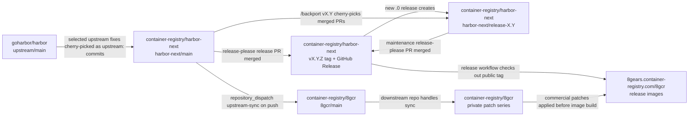
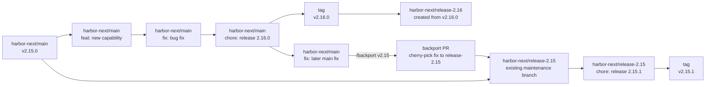
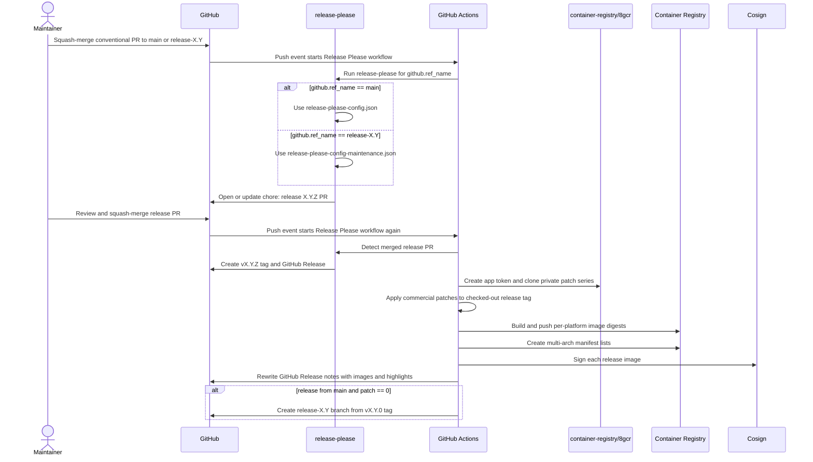

# Release Process

Harbor Next releases are automated with [release-please](https://github.com/googleapis/release-please). Maintainers should not create normal release tags or GitHub Releases by hand. The source of truth is the Git branch that received a squash commit, the conventional commit title, `release-please-config*.json`, `.release-please-manifest.json`, `VERSION`, and `CHANGELOG.md`.

This document is the maintainer runbook for releases, maintenance branches, backports, and downstream 8gcr release builds.

## Repository Flow

Harbor Next sits between upstream Harbor and the downstream 8gcr product repository.



Important boundaries:

- `goharbor/harbor` is the CNCF Harbor upstream. Selected upstream changes land in Harbor Next as `upstream:` commits.
- `container-registry/harbor-next` is the public release source and owns release-please tags, GitHub Releases, and maintenance branches.
- `container-registry/8gcr` is the private downstream repository. Harbor Next sends it an `upstream-sync` dispatch on every push to `harbor-next/main`; the downstream repository handles its own sync behavior.
- Release images are built from the public Harbor Next release tag plus the private 8gcr commercial patch series. The GitHub source release remains the public Harbor Next tag.

## Branch Model

Harbor Next has two release lanes.

| Branch | Purpose | Release behavior |
|--------|---------|------------------|
| `main` | Active development | Produces minor, patch, and major releases from conventional commits |
| `release-X.Y` | Maintenance for a shipped minor line | Produces patch releases only, for example `release-2.15` -> `v2.15.1` |

When `main` cuts a new `.0` release, for example `v2.16.0`, the release workflow automatically creates `release-2.16` from the release tag. That branch is then used for later `v2.16.z` patch releases.

## Branch Movement

This diagram shows the normal movement from active development to a new maintenance branch, then a later backport patch release.



The backport PR is created by `/backport v2.15`. Its PR title is copied from the source PR, and the final squash commit normally keeps that original conventional title.

## Release-Please Sequence



## Release-Please Configuration

The workflow `.github/workflows/release-please.yml` runs on pushes to `main` and `release-*`.

The release-please job uses the current branch as `target-branch`:

```yaml
target-branch: ${{ github.ref_name }}
```

It chooses the config file by branch:

```yaml
config-file: ${{ github.ref_name == 'main' && 'release-please-config.json' || 'release-please-config-maintenance.json' }}
```

Main branch config, `release-please-config.json`:

- Uses `release-type: simple`.
- Uses `VERSION` as the version file.
- Includes `v` in tags, for example `v2.16.0`.
- Uses `.release-please-manifest.json` as the manifest.
- Uses `bootstrap-sha` to define the starting point for release history.
- Allows normal semantic version bumps from conventional commits.

Maintenance branch config, `release-please-config-maintenance.json`:

- Uses the same release type, version file, changelog sections, and manifest.
- Sets `versioning: always-bump-patch`.
- Always creates patch releases from release-worthy commits, even if a backported commit title starts with `feat:`.

Both configs exclude these paths from release calculation:

- `.github/`
- `docs/`
- `tests/`

If a PR only changes excluded paths, release-please should not open a product release PR for that change.

## Version Rules

Release-please reads the squash commit that lands on the target branch. The PR title usually becomes that squash commit title.

| Commit type | Main branch bump | Maintenance branch bump | Release-note section |
|-------------|------------------|-------------------------|----------------------|
| `fix:` | Patch | Patch | Bug Fixes |
| `upstream:` | Patch | Patch | Upstream |
| `perf:` | Patch | Patch | Performance Improvements |
| `feat:` | Minor | Patch | Features |
| `feat!:` or `BREAKING CHANGE:` | Major | Patch | Features / breaking change notes |
| `revert:` | Patch when reverting a releasable change | Patch when reverting a releasable change | Reverts |
| `refactor:` | Do not rely on this as the only release trigger | Do not rely on this as the only release trigger | Code Refactoring |
| `docs:` | Do not rely on this as the only release trigger; ignored when only `docs/` changes | Do not rely on this as the only release trigger | Documentation |
| `ci:`, `chore:`, `build:`, `test:` | No release | No release | Hidden |

Use `ci:` for workflow-only changes, even when they support release automation, because `.github/` changes should not publish product releases.

## Main Release Flow

1. Merge feature and fix PRs to `main` with **Squash and merge** only.
2. Ensure the squash commit title is a valid conventional commit, for example `feat: Add Replication Audit Events` or `fix: Resolve Token Refresh`.
3. Release-please runs on the push to `main` and opens or updates a release PR named `chore: release X.Y.Z`.
4. Review the release PR for the expected `VERSION`, `.release-please-manifest.json`, and `CHANGELOG.md` changes.
5. Merge the release PR with **Squash and merge**.
6. Release-please creates the `vX.Y.Z` GitHub Release and tag.
7. The release workflow checks out the new tag.
8. The workflow applies private 8gcr commercial patches before image builds.
9. The workflow builds multi-arch images for all release components.
10. The workflow signs the images with cosign.
11. The workflow rewrites the GitHub Release notes with image references, verification instructions, generated notes, highlights, and commercial patch notes.
12. If the release version is `vX.Y.0`, the workflow creates `release-X.Y` from the release tag.

## Maintenance Patch Flow

Use maintenance branches for fixes that need to ship on an already released minor line.

1. Get the fix merged to `main` first unless there is a strong reason to patch the maintenance branch directly.
2. Backport the merged `main` PR to each supported maintenance branch that needs the fix.
3. Merge each backport PR into its `release-X.Y` branch with **Squash and merge**.
4. Release-please runs on the push to `release-X.Y` using `release-please-config-maintenance.json`.
5. Release-please opens or updates a patch release PR for that branch.
6. Review that the release PR only advances the patch version, for example `v2.15.1` -> `v2.15.2`.
7. Merge the release PR with **Squash and merge**.
8. The same tag creation, build, signing, and release-note update jobs run for the maintenance release.

Maintenance branches use `always-bump-patch`, so a backported `feat:` commit still creates a patch release. Do not use maintenance branches to introduce intentionally breaking changes.

## Backport Automation

Backports are triggered by comments on merged PRs.

To request a backport, comment on the merged `main` PR:

```text
/backport vX.Y
```

For example:

```text
/backport v2.15
```

The automation only accepts comments from repository owners, members, and collaborators. The command must target an existing `release-X.Y` branch.

When the command is valid, the backport workflow:

1. Verifies that the source PR is merged.
2. Resolves `vX.Y` to `release-X.Y`.
3. Checks out the maintenance branch.
4. Cherry-picks the source PR merge commit with `git cherry-pick -x`.
5. Pushes a branch named like `backport/pr-123-to-release-2.15`.
6. Opens a PR against the maintenance branch.
7. Comments on the original PR with the backport PR URL.

If the cherry-pick conflicts, the workflow comments on the original PR and does not open a backport PR. Resolve the backport manually in that case.

## Backport Suggestions

When a PR is merged to `main`, the backport suggestion workflow comments with available `/backport vX.Y` commands for unscoped PR titles that start with:

- `fix:`
- `upstream:`
- `perf:`
- `revert:`

The current suggestion workflow checks the title with shell globs, so scoped titles such as `fix(core): ...` are valid release commits but do not currently receive an automatic suggestion comment. Maintainers can still use `/backport vX.Y` manually.

The suggestion is a prompt for maintainers, not an automatic backport decision. Only backport changes that are appropriate for the supported maintenance line.

## Release Images

Each release publishes multi-architecture images for `linux/amd64` and `linux/arm64`.

The release workflow publishes these components:

- `harbor-core`
- `harbor-jobservice`
- `harbor-registryctl`
- `harbor-exporter`
- `harbor-portal`
- `harbor-registry`
- `trivy-adapter`

The registry defaults to `8gears.container-registry.com/8gcr`. The workflow can override this with `REGISTRY_ADDRESS` and `REGISTRY_PROJECT` repository variables.

The build job checks out the public release tag, then clones the private `container-registry/8gcr` repository and applies the patch files listed in `8gcr-ee/patches/series` inside that clone. The published images therefore include the commercial patch series even though the GitHub source tag remains the public Harbor Next tag.

After images are pushed, the release workflow signs each image with cosign and rewrites the GitHub Release notes with verification commands.

## Release Notes

Release notes are assembled from multiple sources:

- `CHANGELOG.md` generated by release-please from conventional commits.
- GitHub-generated release notes for PR links and authors.
- PR `## Release Notes` sections, rendered under `## Highlights` when present.
- Commercial patch descriptions collected from the private patch series during release builds.
- Container image references generated by the release workflow.
- Cosign verification instructions generated by the release workflow.

Use `upstream:` for cherry-picked changes from `goharbor/harbor`. Include these trailers in the squash commit body when available:

```text
Upstream-PR: goharbor/harbor#12345
Upstream-Author: @original-author
```

Those trailers allow release notes to credit the original upstream PR and author.

## Required Repository Configuration

The release workflow expects these repository variables and secrets:

| Name | Type | Required | Purpose |
|------|------|----------|---------|
| `RUNNER` | Variable | Optional | Custom runner label. Defaults to `ubuntu-latest` when unset. |
| `REGISTRY_ADDRESS` | Variable | Optional | Image registry host. Defaults to `8gears.container-registry.com`. |
| `REGISTRY_PROJECT` | Variable | Optional | Image registry project. Defaults to `8gcr`. |
| `REGISTRY_USERNAME` | Variable | Yes | Username for pushing release images. |
| `REGISTRY_PASSWORD` | Secret | Yes | Password/token for pushing release images. |
| `SYNC_APP_ID` | Variable | Yes | GitHub App ID used to access `container-registry/8gcr`. |
| `SYNC_APP_PRIVATE_KEY` | Secret | Yes | Private key for the GitHub App used to access `container-registry/8gcr`. |
| `BUILDX_HOST` | Runner environment | Optional | Remote BuildKit endpoint, when supplied by the runner. |

The GitHub App must have access to `container-registry/8gcr`, because release builds clone the private patch repository and the `Notify Fork Sync` workflow dispatches downstream sync events to it.

## Maintainer Checklist

Before merging a normal PR:

1. Confirm the PR title is a valid conventional commit.
2. Confirm the PR will be squash-merged.
3. Confirm user-facing changes include a useful `## Release Notes` section when needed.
4. Confirm upstream cherry-picks use `upstream:` and include upstream attribution trailers.

Before merging a release-please PR:

1. Confirm the target branch is correct: `main` for active development, `release-X.Y` for maintenance.
2. Confirm `VERSION`, `.release-please-manifest.json`, and `CHANGELOG.md` match the intended version.
3. Confirm the version bump matches the branch model.
4. Merge with **Squash and merge**.
5. Watch the `Release Please` workflow until images are built, signed, and release notes are updated.
6. Confirm the GitHub Release notes contain container image references and cosign verification instructions.

Before merging a backport PR:

1. Confirm the base branch is the intended `release-X.Y` branch.
2. Confirm the change is appropriate for a patch release.
3. Confirm CI passed on the maintenance branch.
4. Merge with **Squash and merge**.
5. Wait for the maintenance release-please PR, then review and merge it when ready to publish the patch release.

## Manual Intervention

Manual intervention should be rare. Prefer fixing the automation or the release PR over creating tags manually.

Use manual steps only when:

- A backport cherry-pick conflicts and must be resolved by hand.
- A release workflow fails after creating a GitHub Release and needs the failed job or workflow rerun.
- A release branch needs an exceptional direct fix that cannot land on `main` first.

If a release workflow fails, fix the underlying problem and rerun the affected job or the full workflow, depending on where it failed. Do not create replacement tags or releases unless maintainers agree that the published release is unrecoverable.
