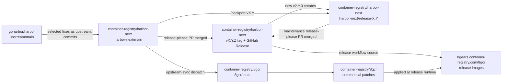
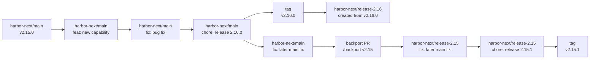
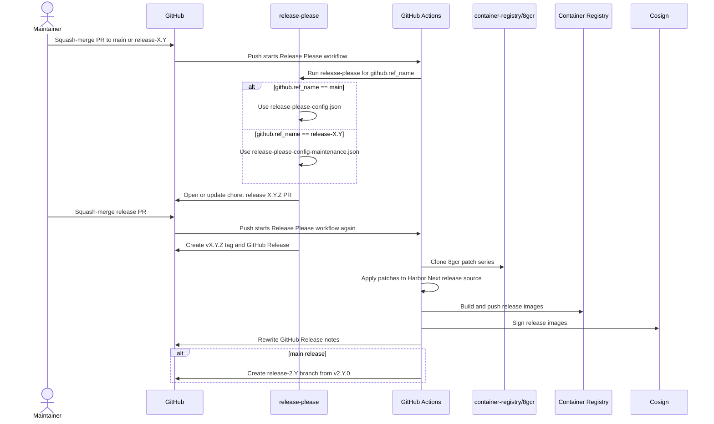

# Release Process

Harbor Next releases are automated with [release-please](https://github.com/googleapis/release-please). Do not create normal release tags or GitHub Releases manually.

Release state is defined by:

- The target branch: `harbor-next/main` or `harbor-next/release-X.Y`
- Conventional squash commit titles
- `release-please-config.json`
- `release-please-config-maintenance.json`
- `.release-please-manifest.json`
- `VERSION`
- `CHANGELOG.md`

## Repository Flow



Rules:

- `upstream/main` is the upstream Harbor source.
- `harbor-next/main` is active Harbor Next development.
- `harbor-next/release-X.Y` is a maintenance branch for patch releases.
- `8gcr/main` provides the commercial patch series used at release runtime.
- Release images are built by checking out the Harbor Next release source, applying 8gcr patches during the workflow run, and building images from that patched working tree.

## Branch Movement



## Release-Please Sequence



## Branch Rules

| Branch | Config | Release behavior |
|--------|--------|------------------|
| `main` | `release-please-config.json` | Minor releases only |
| `release-X.Y` | `release-please-config-maintenance.json` | Patch-only releases |

`main` uses `versioning: always-bump-minor`. It must not create `v3` releases. A release from `main` creates the next `v2.Y.0` version and automatically creates `release-2.Y` from the release tag.

`release-X.Y` uses `versioning: always-bump-patch`. Any release-worthy commit on a maintenance branch produces the next patch version.

## Version Rules

| Commit type | `main` bump | `release-X.Y` bump | Notes section |
|-------------|-------------|--------------------|---------------|
| `fix:` | Minor | Patch | Bug Fixes |
| `upstream:` | Minor | Patch | Upstream |
| `perf:` | Minor | Patch | Performance Improvements |
| `feat:` | Minor | Patch | Features |
| `feat!:` or `BREAKING CHANGE:` | Minor | Patch | Breaking changes |
| `revert:` | Minor when releasable | Patch when releasable | Reverts |
| `ci:`, `chore:`, `build:`, `test:` | No release | No release | Hidden |

Release-please ignores changes that only touch:

- `.github/`
- `docs/`
- `tests/`

Use `ci:` for workflow-only changes.

## Main Release Flow

1. Squash-merge PRs to `main` with valid conventional titles.
2. Release-please opens or updates `chore: release X.Y.Z`.
3. Review `VERSION`, `.release-please-manifest.json`, and `CHANGELOG.md`.
4. Squash-merge the release PR.
5. Release-please creates the `v2.Y.0` tag and GitHub Release.
6. The release workflow checks out the Harbor Next release source.
7. The workflow applies 8gcr patches at release runtime.
8. The workflow builds and pushes multi-arch images.
9. The workflow signs images with cosign.
10. The workflow rewrites the GitHub Release notes.
11. The workflow creates `release-2.Y` for the new minor line.

## Maintenance Release Flow

1. Merge the fix to `main` first unless a direct maintenance fix is required.
2. Backport the merged PR to each required `release-X.Y` branch.
3. Squash-merge the backport PR into `release-X.Y`.
4. Release-please opens or updates the patch release PR.
5. Review the patch version, `VERSION`, `.release-please-manifest.json`, and `CHANGELOG.md`.
6. Squash-merge the release PR.
7. The same image build, patch application, signing, and release-note flow runs.

## Backports

Backports are maintainer-triggered comments on merged PRs:

```text
/backport vX.Y
```

Example:

```text
/backport v2.15
```

Rules:

- Only owners, members, and collaborators can trigger backports.
- The target must exist as `release-X.Y`.
- The source PR must already be merged.
- The workflow cherry-picks the source merge commit with `git cherry-pick -x`.
- The workflow opens a PR against `release-X.Y`.
- If the cherry-pick conflicts, the workflow comments on the source PR and stops.
- If the cherry-pick is empty or already applied, the workflow comments on the source PR and stops without opening a PR.

The suggestion workflow comments with backport commands for merged `main` PRs whose unscoped titles start with `fix:`, `upstream:`, `perf:`, or `revert:`. Scoped titles like `fix(core): ...` do not currently get automatic suggestion comments, but `/backport vX.Y` still works manually.

## Release Images

Each release publishes `linux/amd64` and `linux/arm64` images:

- `harbor-core`
- `harbor-jobservice`
- `harbor-registryctl`
- `harbor-exporter`
- `harbor-portal`
- `harbor-registry`
- `trivy-adapter`

Default registry path: `8gears.container-registry.com/8gcr`.

At release runtime, the workflow clones `container-registry/8gcr`, reads the patch list from `8gcr-ee/patches/series`, applies those patches on top of the checked-out Harbor Next release source, and builds the images. Those images contain the commercial features from the patch series.

## Release Notes

Release notes include:

- Release-please changelog entries
- GitHub-generated PR links and authors
- PR `## Release Notes` highlights
- Commercial patch descriptions from the 8gcr patch series
- Container image references
- Cosign verification commands

Use `upstream:` for cherry-picked changes from `goharbor/harbor` and include upstream attribution when available:

```text
Upstream-PR: goharbor/harbor#12345
Upstream-Author: @original-author
```

## Required Configuration

| Name | Type | Required | Purpose |
|------|------|----------|---------|
| `RUNNER` | Variable | No | Custom runner label |
| `REGISTRY_ADDRESS` | Variable | No | Registry host, defaults to `8gears.container-registry.com` |
| `REGISTRY_PROJECT` | Variable | No | Registry project, defaults to `8gcr` |
| `REGISTRY_USERNAME` | Variable | Yes | Registry push username |
| `REGISTRY_PASSWORD` | Secret | Yes | Registry push password/token |
| `SYNC_APP_ID` | Variable | Yes | GitHub App ID for 8gcr access |
| `SYNC_APP_PRIVATE_KEY` | Secret | Yes | GitHub App private key for 8gcr access |
| `BUILDX_HOST` | Runner environment | No | Remote BuildKit endpoint |

## Maintainer Checklist

Before merging a normal PR:

1. PR title is conventional.
2. Merge method is **Squash and merge**.
3. User-facing changes include `## Release Notes` when needed.
4. Upstream cherry-picks use `upstream:` and attribution trailers.

Before merging a release-please PR:

1. Target branch is correct.
2. Version bump is correct for the branch.
3. `VERSION`, `.release-please-manifest.json`, and `CHANGELOG.md` are correct.
4. Merge method is **Squash and merge**.
5. `Release Please` workflow completes.
6. GitHub Release notes include images and cosign verification.

Before merging a backport PR:

1. Base branch is the intended `release-X.Y` branch.
2. Change is appropriate for a patch release.
3. CI passed.
4. Merge method is **Squash and merge**.
5. Review and merge the maintenance release-please PR when ready to publish.

## Manual Intervention

Manual intervention should be rare.

Allowed cases:

- Resolve a conflicted backport manually.
- Rerun a failed release workflow job or workflow.
- Apply an exceptional direct maintenance fix.

Do not create replacement tags or releases unless maintainers agree the published release is unrecoverable.
