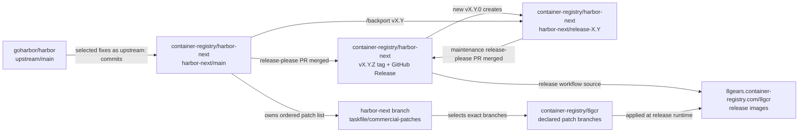
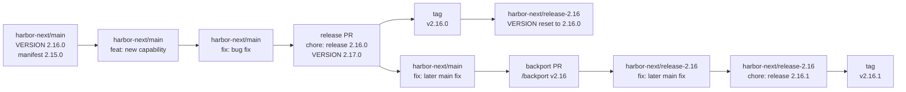
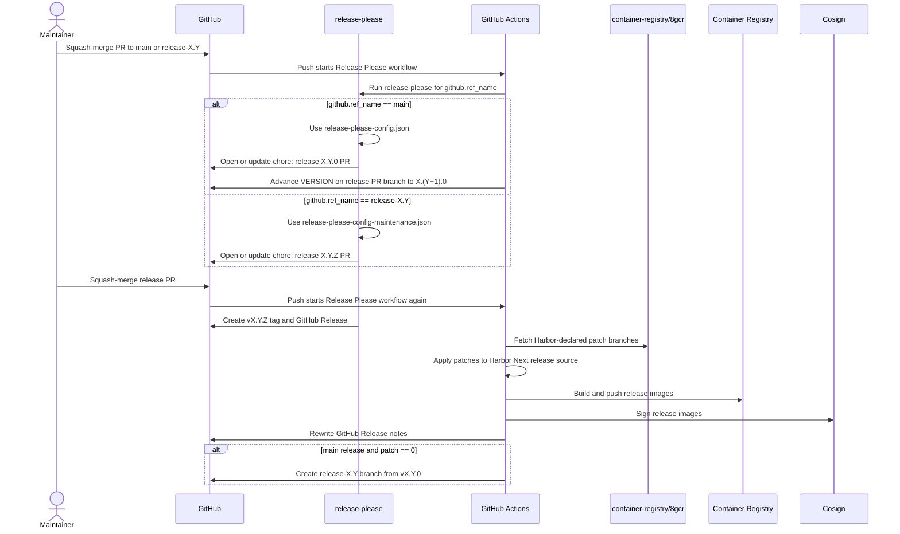

# Release Process

Harbor Next releases are automated with [release-please](https://github.com/googleapis/release-please). Do not create normal release tags or GitHub Releases manually.

Release state is defined by:

- The target branch: `harbor-next/main` or `harbor-next/release-X.Y`
- Conventional squash commit titles
- `release-please-config.json`
- `release-please-config-maintenance.json`
- `.release-please-manifest.json`
- `VERSION`
- `CHANGELOG.md`

`main` intentionally tracks the next development release in `VERSION`. For example, while `main` is preparing `2.16.0`, `VERSION` is `2.16.0` even though the last published release may still be `2.15.0`. The authoritative release-please state for the last published version is `.release-please-manifest.json`.

On `main`, release-please uses the Go strategy and does not own `VERSION`; the workflow advances `VERSION` on the generated release PR branch. On `release-X.Y`, release-please uses the simple strategy and updates `VERSION` to the patch release version.

## Repository Flow


```mermaid
flowchart LR
  upstream["goharbor/harbor\nupstream/main"]
  harborMain["container-registry/harbor-next\nharbor-next/main"]
  harborRelease["container-registry/harbor-next\nharbor-next/release-X.Y"]
  harborTag["container-registry/harbor-next\nvX.Y.Z tag + GitHub Release"]
  patchManifest["harbor-next branch\ntaskfile/commercial-patches"]
  gcrPatches["container-registry/8gcr\ndeclared patch branches"]
  images["8gears.container-registry.com/8gcr\nrelease images"]

  upstream -->|selected fixes as upstream: commits| harborMain
  harborMain -->|release-please PR merged| harborTag
  harborTag -->|new vX.Y.0 creates| harborRelease
  harborMain -->|/backport vX.Y| harborRelease
  harborRelease -->|maintenance release-please PR merged| harborTag
  harborMain -->|owns ordered patch list| patchManifest
  patchManifest -->|selects exact branches| gcrPatches
  harborTag -->|release workflow source| images
  gcrPatches -->|applied at release runtime| images
```

Rules:

- `upstream/main` is the upstream Harbor source.
- `harbor-next/main` is active Harbor Next development.
- `harbor-next/release-X.Y` is a maintenance branch for patch releases.
- Each Harbor Next branch owns its ordered commercial patch list in `taskfile/commercial-patches`.
- The release fetches only those named branches from `8gcr`; it never reads or imports `8gcr/main`.
- Release images are built by checking out the Harbor Next release source, applying 8gcr patches during the workflow run, and building images from that patched working tree.

## Branch Movement


```mermaid
flowchart LR
  a["harbor-next/main\nVERSION 2.16.0\nmanifest 2.15.0"]
  b["harbor-next/main\nfeat: new capability"]
  c["harbor-next/main\nfix: bug fix"]
  d["release PR\nchore: release 2.16.0\nVERSION 2.17.0"]
  e["tag\nv2.16.0"]
  f["harbor-next/release-2.16\nVERSION reset to 2.16.0"]
  g["harbor-next/main\nfix: later main fix"]
  h["backport PR\n/backport v2.16"]
  i["harbor-next/release-2.16\nfix: later main fix"]
  j["harbor-next/release-2.16\nchore: release 2.16.1"]
  k["tag\nv2.16.1"]

  a --> b --> c --> d --> e --> f
  d --> g --> h --> i --> j --> k
```

## Release-Please Sequence


```mermaid
sequenceDiagram
  actor Maintainer
  participant GitHub
  participant RP as release-please
  participant Actions as GitHub Actions
  participant GCR as container-registry/8gcr
  participant Registry as Container Registry
  participant Cosign

  Maintainer->>GitHub: Squash-merge PR to main or release-X.Y
  GitHub->>Actions: Push starts Release Please workflow
  Actions->>RP: Run release-please for github.ref_name
  alt github.ref_name == main
    RP->>RP: Use release-please-config.json
    RP->>GitHub: Open or update chore: release X.Y.0 PR
    Actions->>GitHub: Advance VERSION on release PR branch to X.(Y+1).0
  else github.ref_name == release-X.Y
    RP->>RP: Use release-please-config-maintenance.json
    RP->>GitHub: Open or update chore: release X.Y.Z PR
  end
  Maintainer->>GitHub: Squash-merge release PR
  GitHub->>Actions: Push starts Release Please workflow again
  RP->>GitHub: Create vX.Y.Z tag and GitHub Release
  Actions->>GCR: Fetch Harbor-declared patch branches
  Actions->>Actions: Apply patches to Harbor Next release source
  Actions->>Registry: Build and push release images
  Actions->>Cosign: Sign release images
  Actions->>GitHub: Rewrite GitHub Release notes
  alt main release and patch == 0
    Actions->>GitHub: Create release-X.Y branch from vX.Y.0
  end
```

## Branch Rules

| Branch | Config | Release behavior |
|--------|--------|------------------|
| `main` | `release-please-config.json` | Always bumps to the next minor release |
| `release-X.Y` | `release-please-config-maintenance.json` | Patch-only releases |

`main` uses `versioning: always-bump-minor`. All release-worthy commits on `main` are collected into the next minor release. A new `.0` release from `main` automatically creates `release-X.Y` from the release tag, then resets `VERSION` on that maintenance branch to the released `X.Y.0` value.

`release-X.Y` uses `versioning: always-bump-patch`. Any release-worthy commit on a maintenance branch produces the next patch version.

## Version Rules

| Commit type | `main` bump | `release-X.Y` bump | Notes section |
|-------------|-------------|--------------------|---------------|
| `fix:` | Minor | Patch | Bug Fixes |
| `upstream:` | Minor | Patch | Upstream |
| `perf:` | Minor | Patch | Performance Improvements |
| `feat:` | Minor | Patch | Features |
| `feat!:` or `BREAKING CHANGE:` | Minor | Patch | Breaking changes |
| `revert:` | Minor when reverting releasable change | Patch when reverting releasable change | Reverts |
| `ci:`, `chore:`, `build:`, `test:` | No release | No release | Hidden |

Release-please ignores changes that only touch:

- `.github/`
- `docs/`
- `tests/`
- `taskfile/`

Use `ci:` for workflow-only changes.

## Main Release Flow

1. Squash-merge PRs to `main` with valid conventional titles.
2. Release-please opens or updates `chore: release X.Y.0`.
3. The workflow advances `VERSION` on that release PR branch to `X.(Y+1).0` so `main` moves straight into the next development cycle after the release PR merges.
4. Review `.release-please-manifest.json` and `CHANGELOG.md` for the released `X.Y.0` version, and review `VERSION` for the next development target.
5. Squash-merge the release PR.
6. Release-please creates the `vX.Y.0` tag and GitHub Release from the manifest version, not from `VERSION`.
7. The release workflow checks out the Harbor Next release source.
8. The workflow applies 8gcr patches at release runtime.
9. The workflow builds and pushes multi-arch images with the release-please output version.
10. The workflow signs images with cosign.
11. The workflow rewrites the GitHub Release notes.
12. The workflow creates `release-X.Y` and resets `VERSION` on that maintenance branch to `X.Y.0`.

## Maintenance Release Flow

1. Merge the fix to `main` first unless a direct maintenance fix is required.
2. Backport the merged PR to each required `release-X.Y` branch.
3. Squash-merge the backport PR into `release-X.Y`.
4. Release-please opens or updates the patch release PR.
5. Review the patch version, `VERSION`, `.release-please-manifest.json`, and `CHANGELOG.md`.
6. Squash-merge the release PR.
7. The same image build, patch application, signing, and release-note flow runs.

## Nightly Channel

A nightly is the real release pipeline cut against a throwaway branch, so Harbor gets exercised every day instead of once per minor. The `Nightly` workflow runs at 00:00 UTC and on `workflow_dispatch`, from `main` only: a nightly carries the official tag and image names, so a run from any other ref is rejected rather than publishing that ref's code under them.

Nightly versions look like `2.16.0-nightly-20260918`: the `VERSION` on `main`, which is the minor release-please is heading for, plus the UTC date. The tag is `v2.16.0-nightly-20260918` and the images are pushed under that same tag, exactly as a real release tags its own.

The channel is release-please configuration, not a separate build path:

1. `task nightly:channel` derives `release-please-config-nightly.json` from `release-please-config.json` with `jq`, adding `release-as` for tonight's version and `prerelease: true`. Deriving it keeps the exclude paths and changelog sections identical to the real release forever.
2. The same task seeds `.release-please-manifest-nightly.json` from `.release-please-manifest.json` and commits both. It force-pushes the result as the `nightly` branch only when the caller passes `PUSH_CHANNEL=true`, as the workflow does; a bare `task nightly:channel` leaves the branch local, which is how you inspect what tonight's channel would be. Neither generated file is committed to `main`.
3. Release-please opens a release PR against `nightly`, the workflow squash-merges it, and release-please then tags the merge and publishes a prerelease GitHub Release.
4. `publish-images.yml` and `release-notes-engine.yml` run with the nightly tag. They are the same reusable workflows the real release calls.

`release-as` is what pins the date. The `prerelease` versioning strategy cannot: it increments the last run of digits in the current prerelease, so `2.16.0-nightly-20260918` becomes `...20260919` on the next run whatever the calendar says, and one repeated or skipped night desynchronizes the stamp for good. The generated `release-as` is recomputed from the clock every night, so it cannot go stale the way a committed `release-as` does.

Two things follow from the channel being rebuilt every night. An empty night, where nothing has landed since the last real release, produces no release PR: the run ends green having published nothing, and says so. And a nightly that already tagged cannot be re-run for the same date, because that tag exists; re-run a nightly that failed before tagging, and pass `date_stamp` if you need a second one on the same day.

Merging the nightly release PR is the one merge this repository automates. It happens inside the workflow, on a branch that is thrown away the next night, and it never touches a release PR on `main` or `release-X.Y`.

### Version timeline

Because the channel manifest is re-seeded from `.release-please-manifest.json` every night, the nightly channel never advances the published version. Each nightly is computed from the last published release, so the minor stays parked until a maintainer cuts the real release:

| Date | `.release-please-manifest.json` | Nightly release | Notes cover |
|------|---------------------------------|-----------------|-------------|
| Sep 18 | `2.15.0` | `v2.16.0-nightly-20260918` | everything since `v2.15.0` |
| Sep 19 | `2.15.0` | `v2.16.0-nightly-20260919` | everything since `v2.15.0`, plus one day |
| Sep 20 | `2.15.0` | `v2.16.0-nightly-20260920` | everything since `v2.15.0`, plus two days |
| Sep 21 | a maintainer merges the `main` release PR: `v2.16.0` is published, the manifest moves to `2.16.0`, `VERSION` to `2.17.0` | `v2.16.0-nightly-20260921` if the nightly ran before the merge, `v2.17.0-nightly-20260921` if after | accordingly |
| Sep 22 | `2.16.0` | `v2.17.0-nightly-20260922` | everything since `v2.16.0` |

The stable `v2.16.0` on Sep 21 is the ordinary main release, cut by a maintainer. A nightly always derives a dated `release-as` and always publishes as a prerelease, so it can never produce a stable version; it just follows the line to whatever the next one is.

### Nightly release notes

Nightly notes are the upcoming release's notes as they stand tonight, not a separate stream. There is no nightly changelog, no nightly section in `CHANGELOG.md` on `main`, and no nightly entry in the commercial changelogs.

Two things make that true:

- The channel accumulates from the last published release, so release-please renders the whole in-progress release into the nightly `CHANGELOG.md` section, and `What's Changed` spans the same range.
- The nightly workflow does not dispatch `release-cut` to `8gcr`. The commercial entries stay in the unreleased block of each `changelogs/<branch>.md`, so every nightly renders the same commercial features the real release will, and the real release still finds them when it ships.

A nightly's notes therefore read as a preview of the release: the same sections, the same commercial features, the same contributors, with the image references pointing at the nightly tag.

## Backports

Backports are maintainer-triggered comments on merged PRs:

```text
/backport vX.Y
```

Example:

```text
/backport v2.15
```

Rules:

- Only owners, members, and collaborators can trigger backports.
- The target must exist as `release-X.Y`.
- The source PR must already be merged.
- The workflow cherry-picks the source merge commit with `git cherry-pick -x`.
- The workflow opens a PR against `release-X.Y`.
- If the cherry-pick conflicts, the workflow comments on the source PR and stops.

The suggestion workflow comments with backport commands for merged `main` PRs whose unscoped titles start with `fix:`, `upstream:`, `perf:`, or `revert:`. Scoped titles like `fix(core): ...` do not currently get automatic suggestion comments, but `/backport vX.Y` still works manually.

## Release Images

Each release publishes `linux/amd64` and `linux/arm64` images:

- `harbor-core`
- `harbor-jobservice`
- `harbor-registryctl`
- `harbor-exporter`
- `harbor-portal`
- `harbor-registry`
- `trivy-adapter`

Default registry path: `8gears.container-registry.com/8gcr`.

At release runtime, the workflow reads `taskfile/commercial-patches` from the checked-out Harbor Next branch, fetches only those branches from `container-registry/8gcr`, applies their declared commit deltas, and builds the images. The workflow never fetches `8gcr/main` or an 8gcr-owned series file.

Use `task apply-patches` to apply that manifest to a clean checkout and `task release-ready` to validate it against a disposable clean clone. For a local unsigned build and push to the PR registry project (`8gcr-pr` by default), authenticate the container engine and run `task release-images-local RELEASE_VERSION=X.Y.Z IMAGE_TAG=<tag>`; the local task verifies both published architectures after pushing. Main and maintenance-release workflows publish to `8gcr`.

## Release Notes

Release notes include:

- Release-please changelog entries
- GitHub-generated PR links and authors
- PR `## Release Notes` highlights
- Commercial patch descriptions from the 8gcr patch series
- Container image references
- Cosign verification commands

Use `upstream:` for cherry-picked changes from `goharbor/harbor` and include upstream attribution when available:

```text
Upstream-PR: goharbor/harbor#12345
Upstream-Author: @original-author
```

## Required Configuration

| Name | Type | Required | Purpose |
|------|------|----------|---------|
| `REGISTRY_ADDRESS` | Variable | No | Registry host, defaults to `8gears.container-registry.com` |
| `REGISTRY_PROJECT` | Variable | No | Registry project, defaults to `8gcr` |
| `REGISTRY_USERNAME` | Variable | Yes | Registry push username |
| `REGISTRY_PASSWORD` | Secret | Yes | Registry push password/token |
| `SYNC_APP_ID` | Variable | Yes | GitHub App ID for 8gcr access |
| `SYNC_APP_PRIVATE_KEY` | Secret | Yes | GitHub App private key for 8gcr access |
| `BUILDX_HOST` | Runner environment | No | Remote BuildKit endpoint |
| `NIGHTLY_CHANNEL_TOKEN` | Secret | No | Only needed if a ruleset ever covers the `nightly` branch; the nightly channel push and merge fall back to `GITHUB_TOKEN` |

## Maintainer Checklist

Before merging a normal PR:

1. PR title is conventional.
2. Merge method is **Squash and merge**.
3. User-facing changes include `## Release Notes` when needed.
4. Upstream cherry-picks use `upstream:` and attribution trailers.

Before merging a release-please PR:

1. Target branch is correct.
2. Version bump is correct for the branch.
3. On `main`, `.release-please-manifest.json` and `CHANGELOG.md` match the release being published, while `VERSION` points at the following minor development target.
4. On `release-X.Y`, `VERSION`, `.release-please-manifest.json`, and `CHANGELOG.md` all match the patch release being published.
5. Merge method is **Squash and merge**.
6. `Release Please` workflow completes.
7. GitHub Release notes include images and cosign verification.

Before merging a backport PR:

1. Base branch is the intended `release-X.Y` branch.
2. Change is appropriate for a patch release.
3. CI passed.
4. Merge method is **Squash and merge**.
5. Review and merge the maintenance release-please PR when ready to publish.

## Manual Intervention

Manual intervention should be rare.

Allowed cases:

- Resolve a conflicted backport manually.
- Rerun a failed release workflow job or workflow.
- Apply an exceptional direct maintenance fix.

Do not create replacement tags or releases unless maintainers agree the published release is unrecoverable.
