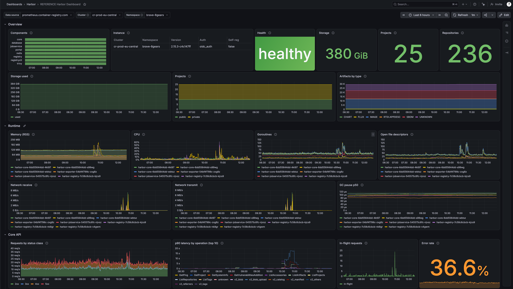
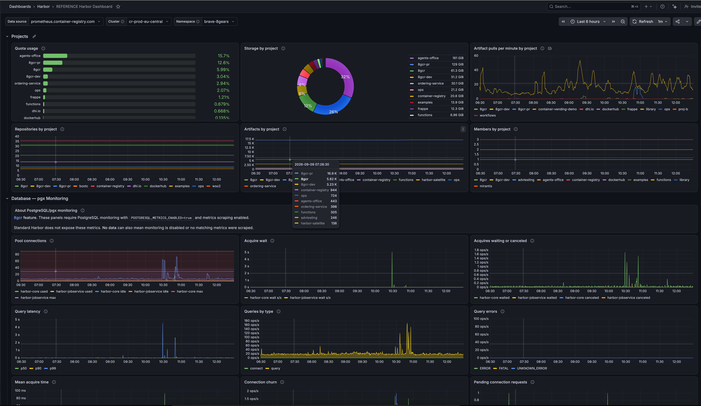

# Harbor Grafana dashboard

[Download the dashboard JSON](../../deploy/chart/dashboards/harbor.json).
The single source is `deploy/chart/dashboards/harbor.json`, used unchanged for
manual import and Helm provisioning. There is no generator or second JSON copy.

The dashboard builds on the [upstream Harbor metrics example](https://github.com/goharbor/harbor/blob/main/contrib/grafana-dashboard/metrics-example.json) and covers health,
runtime, storage, projects, core API traffic, registry and storage-backend metrics,
and jobservice. It also includes PostgreSQL/pgx monitoring available in the
[8gcr Harbor distribution](https://container-registry.com/8gcr/), with a visible
feature note and panel tooltips explaining empty results on standard Harbor.

## Preview

Overview and Runtime, with shared datasource, cluster and namespace selectors:



Project usage and the 8gcr PostgreSQL/pgx monitoring panels:



## Prerequisites

- Metrics enabled on Harbor (`metric.enabled: true` in `harbor.yml`, or
  `metrics.enabled: true` in the Helm chart), exposing metrics on core,
  jobservice and registry.
- The Harbor exporter running and scraped. It provides `harbor_up`, `harbor_health`,
  `harbor_system_info`, `harbor_statistics_*` and `harbor_project_*`.
- All four targets (core, jobservice, registry, exporter) scraped by the selected
  Prometheus datasource.
- Consistent `cluster` and `namespace` labels on all Harbor series, including
  exporter, runtime and pgx metrics, to identify the installation in the selectors.
- Runtime and pgx panels select `service=~".*harbor.*"`; the scraped service label
  must contain `harbor` for those panels to return data.
- Database panels require an 8gcr build with pgx monitoring, enabled with
  `POSTGRESQL_METRICS_ENABLED=true`, and metrics scraping. Standard Harbor does not
  emit those metrics. Empty panels can also mean monitoring is disabled or no
  matching metrics were scraped.

## Shared selectors

These three dropdowns appear once at the top and filter every metric panel:

| Selector | Purpose |
|----------|---------|
| **Data source** | Prometheus datasource containing the Harbor metrics. |
| **Cluster** | Select one cluster from `harbor_up`; defaults to the first available cluster alphabetically. |
| **Namespace** | Select one Harbor namespace in that cluster; defaults to the first available namespace alphabetically. |

Both selectors are single-select without **All**. No environment-specific
selection is shipped. Grafana uses the first available value when no valid
selection exists. Namespace refreshes when Cluster changes, keeping the selected
namespace if it exists in the new cluster and otherwise selecting the first one.
Valid selections are preserved on refresh; dashboard URLs can pin an installation.

The dashboard shows one cluster and namespace at a time, so identical namespace
names in dev, stage and prod remain separate. Exporter gauges are deduplicated
within the selected cluster and namespace. Legends show component, pod, project
or service names without repeating the cluster and namespace.
Two Harbor installations in the same cluster and namespace are not distinguished.

First-entry defaults require available label values. If metrics lack a `cluster`
or `namespace` label (for example, Compose or a datasource dedicated to one
cluster), add consistent labels to each Harbor scrape target. For Compose, use
an environment name and an installation name. Empty selectors can also indicate
missing Harbor metrics or a failed datasource query. Runtime and pgx also need
the service label described above.

## Import and provisioning

1. Download `deploy/chart/dashboards/harbor.json`. On GitHub, use **Download raw file**.
2. In Grafana, open **Dashboards → New → Import**, upload the JSON and import it.
3. Choose the Prometheus **Data source**, then Cluster and Namespace at the top.

With the [Harbor Next Helm chart](../../deploy/chart/README.md), set
`metrics.grafanaDashboard.enabled: true`. The chart embeds the same JSON in a
ConfigMap for a Grafana dashboard sidecar, such as the one in kube-prometheus-stack.
The sidecar must watch the ConfigMap's namespace and labels. See the
[monitoring example](../../deploy/chart/example/grafana-dashboard/) for values
and prerequisites.

Provision this dashboard only once per Grafana organization: its UID is
`harbor-overview`. Use the selectors to navigate multiple Harbor installations.

## Rows

All rows are expanded by default, in this order:

- **Overview**: component up/down, version and auth mode, health, storage, project
  and repository totals, public/private projects and artifacts by type.
- **Runtime**: RSS, CPU, goroutines, open file descriptors, network receive/transmit
  and GC pause per Harbor process.
- **Core API**: request rate by status class, latency per operation, in-flight
  requests, error rate, operations producing errors and 404s, and 5xx responses.
- **Registry**: requests and latency by handler, in-flight requests, 5xx share,
  throughput, storage backend calls and latency, blob-descriptor cache and proxy cache.
- **Jobs**: task rates and failures, queue size and latency, running tasks, duration,
  scheduled jobs, jobservice replicas and worker pools.
- **Projects**: quota usage, storage, artifact pulls, repositories, artifacts and members.
- **Database — pgx Monitoring**: 8gcr feature note, pool usage and capacity, acquire
  wait, query latency and errors, connection churn and pending connections.

## Editing

Edit `deploy/chart/dashboards/harbor.json` directly, or import it into Grafana,
edit visually, and export the classic dashboard JSON back to that file. When editing
a provisioned dashboard, export your changes: provisioning can overwrite UI changes.

Before saving an export:

- Keep the dashboard UID `harbor-overview`, title `Harbor`, existing panel IDs,
  and the approved layout and panel descriptions.
- Keep `${datasource}` references and the shared `cluster`/`namespace` filters.
  Avoid exports that replace them with import-only datasource placeholders.
- Remove the Grafana database `id` and revision `version`.
- Clear every variable's `current` to `{}` and `options` to `[]` so no local
  selections are shipped. Keep Cluster and Namespace alphabetically sorted
  (`sort: 1`) and single-select (`multi: false`), with `includeAll: false`,
  `allowCustomValue: false` and no `allValue`. Grafana selects the first available
  value when no valid selection exists.
- Preserve the 8gcr feature note and tooltips, and keep Runtime below Overview.

Helm parses the JSON whenever the dashboard is enabled; existing ConfigMap tests
and the monitoring example exercise that path in chart CI. From the repository root:

```sh
task helm:helm-lint helm:helm-template helm:unittest helm:examples
```

Finally, import the JSON into Grafana and verify datasource switching, cluster and
namespace filtering, and representative queries against live metrics.
