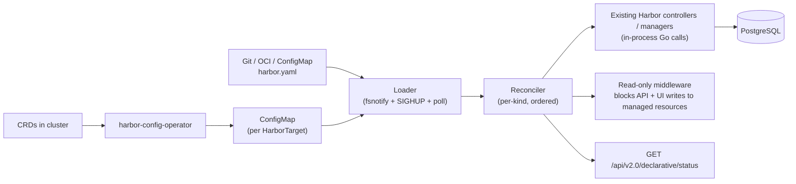
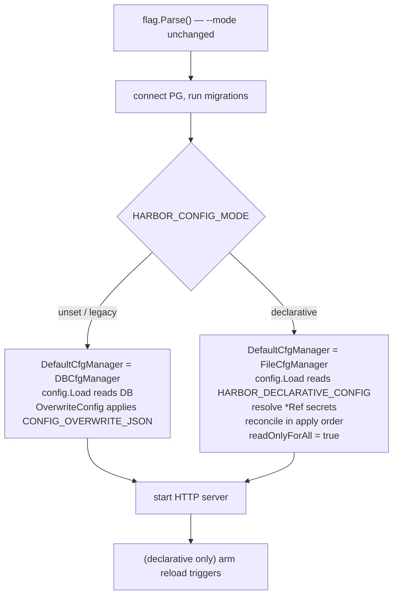
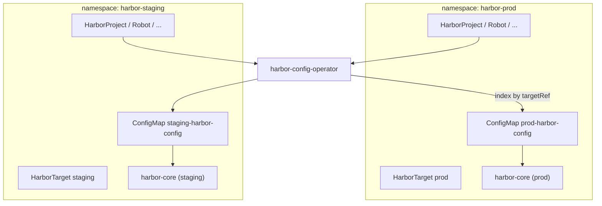

# ADR-0001: Harbor Declarative Configuration (Config-as-Code)

| Attribute | Value |
|-----------|-------|
| **Title** | Harbor Declarative Configuration (Config-as-Code / GitOps) |
| **Status** | Proposed (alpha design) |
| **Authors** | 8gcr / Harbor Community |
| **Date** | 2026-06-16 |
| **Version** | 0.1 (`harbor.goharbor.io/v1alpha1`) |
| **Technical Area** | Core configuration, GitOps, Kubernetes integration |
| **Related** | [flux-operator-harbor-example](https://github.com/matheuscscp/flux-operator-harbor-example) · [steadforce/harbor-day2-operator](https://github.com/steadforce/harbor-day2-operator) · [rkthtrifork/harbor-operator](https://github.com/rkthtrifork/harbor-operator) · [vtmocanu/harbor-crossplane](https://github.com/vtmocanu/harbor-crossplane) |

> **Naming note.** This work was originally drafted under the title *"Harbor Day 2 Operator."*
> That name is misleading: per Decision 1 below, we explicitly do **not** build a Kubernetes
> operator that installs or runs Harbor. The deliverable is *declarative configuration of an
> already-running Harbor*. The only operator involved is a thin component that renders CRDs into a
> ConfigMap. The feature is referred to throughout as **declarative configuration** or
> **config-as-code**.

---

> **Document structure.** This is a single decision record in two parts: **Part I — Decision Record**
> (problem, options, decisions, consequences) and **Part II — Technical Design** (architecture,
> verified baseline, implementation plan, verification, and the exhaustive `harbor.yaml` reference in
> Appendix A). Product- and user-facing material lives in Notion (task TAS-484).

---

## Table of Contents

**Part I — Decision Record**
1. Executive Summary
2. Problem Statement
3. Decision Drivers
4. Options Considered
5. Decisions (D1–D11)
6. Consequences
7. References (Prior Art)

**Part II — Technical Design**
1. Architecture
2. Existing config plumbing (verified baseline)
3. Boot order in declarative mode
4. Live-reload mechanism (k8s-aware)
5. Reconciler behaviour
6. CRD surface and multi-Harbor model
7. Read-only behaviour in the Web UI
8. Implementation plan
9. Baseline verification & corrections
10. Delivery & upstreaming
11. Verification matrix
12. Traceability: goals → decisions → phases → tests
13. Operational design (review-driven resolutions)
- Appendix A — exhaustive `harbor.yaml` reference

---

# Part I — Decision Record

## 1. Executive Summary

Harbor today has no file-driven configuration surface for its user-facing state. Projects, robots,
registries, replication/retention policies, webhooks, scanners, and system settings are mutated only
through the REST API and Web UI (which write the PostgreSQL `properties` table and per-resource
tables). This makes end-to-end GitOps impossible to close: a Flux/Argo pipeline can deliver
workloads but cannot declare the Harbor projects and identity bindings those workloads depend on.

This ADR records the decision to add a **declarative configuration mode** to Harbor Core. In this
mode a single canonical file, `harbor.yaml`, is the source of truth for all user-facing
configuration. A reconciler drives Harbor's existing controllers in-process to converge live state
to the declared state, blocks out-of-band REST/UI writes, detects and corrects drift, and adopts
pre-existing resources. A companion Kubernetes operator renders namespaced CRDs into the same
`harbor.yaml` (as a ConfigMap) so that k8s-native users and file/edge users share one contract.

The work ships as an **alpha** (`v1alpha1`), deliberately unpolished, to gather community feedback;
breaking changes are expected before v1.

## 2. Problem Statement

Harbor Core exposes configuration through three surfaces, none of them file-driven:

1. **Environment variables** (set by docker-compose / Helm) for bootstrap concerns.
2. **The PostgreSQL `properties` table**, holding the ~117 application-config keys defined in
   `src/lib/config/metadata/metadatalist.go`, mutated via `/api/v2.0/configurations` and the Web UI.
3. **Per-resource REST endpoints** (projects, robots, registries, replications, retentions,
   webhooks, scanners, immutables, labels, user groups, schedules).

There is no `harbor.yaml` for Core; the only file mounted into the Core container is
`token_service_key.pem`. The other services have YAML configs (`config/jobservice.yml`,
`config/registry.yml`, `config/registryctl.yml`) but those configure their own runtime, not Harbor's
user-facing state.

The concrete trigger: [matheuscscp/flux-operator-zot-example](https://github.com/matheuscscp/flux-operator-zot-example)
closes the GitOps loop fully — Zot's entire config lives in a HelmRelease's
`values.configFiles.config.json`, Flux delivers it, the registry comes up correctly. The companion
[matheuscscp/flux-operator-harbor-example](https://github.com/matheuscscp/flux-operator-harbor-example)
hits a wall: projects and OIDC federated-identity bindings must be configured in Harbor manually
before Flux's push job and the tenant `OCIRepository`s can succeed. Closing that gap is the entire
motivation.

From the Slack thread with Matheus Pimenta (Flux maintainer) that triggered this work:

> making it possible to configure everything in Harbor declaratively is what makes a flux maintainer happy
>
> "configure Harbor declarative" is a completely different and easier problem to solve versus
> "allow people to deploy multiple harbor instances in a cluster the kubernetes way"

## 3. Decision Drivers

- **Close the GitOps loop** without manual API/UI steps — the primary user-visible outcome.
- **Serve both k8s-native and non-k8s users** (Helm-only, raw Docker, edge) from one contract.
- **Minimise surface area in Harbor Core** — reuse existing controllers and config seams; do not pull
  Kubernetes client libraries into Core.
- **Day-2 value** (drift correction, audit-of-source, live reload) over day-1 install automation
  (already handled by the Helm chart).
- **Avoid a migration cliff**: whatever ships in alpha should not strand early adopters when CRDs land.
- **Be honest about scope**: ship an alpha fast, accept breaking changes, iterate.

## 4. Options Considered

### Option A — Kubernetes operator that owns Harbor's deployment (rejected)

Prior art: archived `goharbor/harbor-operator`, [rkthtrifork/harbor-operator](https://github.com/rkthtrifork/harbor-operator).
A CRD-driven operator that installs and runs Harbor.

- **Pros:** k8s-native install + config in one place.
- **Cons:** Owns all of Harbor's deployment dependencies (Postgres, Redis, Registry, storage);
  excludes non-k8s users; the schema balloons (*"HarborInstance CRD would be humongous"*); duplicates
  the existing Helm chart; day-1 install is the *less* valuable half.

### Option B — File-only declarative config (rejected as the end state, kept as alpha phase 1)

A `harbor.yaml` consumed by Core, no CRDs.

- **Pros:** Smallest possible change; works everywhere.
- **Cons:** k8s-native users want CRDs (RBAC, `kubectl`, admission). Shipping file-only first and CRDs
  later risks a migration cliff if the file is not designed as the canonical contract from day one.

### Option C — File + CRDs, file canonical (selected)

`harbor.yaml` is the canonical schema. A separate operator renders CRDs into that same file (as a
ConfigMap). Core consumes only the file.

- **Pros:** One reconciler in Core, two ways to feed it; universal users and k8s users share one
  contract; no k8s libraries in Core; eliminates the migration cliff.
- **Cons:** More work than file-only alpha (mitigated by phasing — Core file support first, operator later).

### Option D — Config via REST as an admin sidecar (rejected)

Prior art: [steadforce/harbor-day2-operator](https://github.com/steadforce/harbor-day2-operator)
(Python sidecar), [rkthtrifork/harbor-operator](https://github.com/rkthtrifork/harbor-operator).
An external process reconciles by calling Harbor's REST API as admin.

- **Pros:** No Core changes; works against stock Harbor.
- **Cons:** Admin-credential management; HTTP loopback; no transactional grouping; no read-only
  enforcement (steadforce silently overwrites drift on next sync); cannot mark resources "managed" in
  the UI. We adopt the in-process approach instead (Decision 6).

## 5. Decisions

### Decision 1 — Solve "configure Harbor declaratively", not "install Harbor as CRDs"

Solving configuration-as-data is smaller, ships in the Harbor binary itself, works for both k8s and
non-k8s, and unblocks the Flux end-to-end demo today. Day-2 features (drift correction,
audit-of-source, live reload) are more valuable than day-1 install automation, which the Helm chart
already solves. *(Supersedes Option A.)*

### Decision 2 — Ship file + CRDs, file is canonical

The canonical schema is `harbor.yaml`. A separate Kubernetes companion operator
(`harbor-config-operator`) watches CRDs in-cluster, deterministically merges them into the canonical
`harbor.yaml`, and writes that as a `ConfigMap` consumed by Harbor Core. **Harbor Core never imports
k8s libraries. The operator never calls Harbor's REST API.** One reconciler, two feeds. *(Selects Option C.)*

### Decision 3 — Either-or at boot, no mixing

A single environment variable, `HARBOR_CONFIG_MODE`, is decided once at process start:

- unset / `legacy` → today's behaviour bit-for-bit (env vars + DB + REST writes + `CONFIG_OVERWRITE_JSON`).
- `declarative` → the file is the source, REST writes are blocked, the reconciler owns state.

There is no in-process switch between modes; only a restart with a different value. Mixing modes
silently produces "env happened to override file, you're confused for 3 hours" outcomes — explicitly rejected.

### Decision 4 — Single authoritative source per category per mode

Harbor Core has two distinct configuration categories that live in different stores and must not be
merged into one precedence chain:

| Category | Legacy mode | Declarative mode |
|---|---|---|
| **Bootstrap** — DB connection, Redis, signing keys, inter-service URLs, log level, encryption key | env vars only | env vars only |
| **Application config** — the ~117 keys in `src/lib/config/metadata/metadatalist.go` plus all per-resource state | PostgreSQL `properties` + per-resource tables, via REST/UI | `harbor.yaml`, via Git |
| **Secrets referenced** inside application config | encrypted in DB | resolved at apply time from exactly one of `env` / `file` / `k8s-secret` — no fallback chain |

DB and file are never both authoritative for application config in the same boot. That is what makes
drift detection meaningful: the reconciler can compute `desired − live` because there is exactly one
valid `desired`.

### Decision 5 — Adoption is explicit per resource by default

A fresh Harbor on restored Postgres + S3 already has projects, robots, replications. The reconciler
must adopt them, not duplicate or replace. Default is `adoption: explicit` — the user adds
`adopt: true` per resource the first time they declare a same-named resource that already exists.
Automatic `adoption: byName` is opt-in for greenfield instances. Adopted resources gain a
`harbor.goharbor.io/managed-by` label; resources without the label are out of scope. This matches
Crossplane's annotation pattern.

### Decision 6 — Reconciler talks to controllers in-process, not via REST

Harbor's existing controller layer already exposes Create/Update/Delete/Get/List as Go interfaces,
used today by the REST handler layer. The reconciler calls those interfaces directly: no HTTP
loopback, no internal admin token, no auth round-trips, and free participation in the controllers'
transaction layer (e.g. project create + members + metadata atomically). A `context.Context` tag
(`declarative.WithReconcilerContext(ctx)`) marks reconciler-originated calls for audit attribution
and to bypass the read-only middleware.

> **Correction vs the original brainstorm.** The brainstorm listed `label` among
> `src/controller/{...}`. There is **no `src/controller/label/` package**. Labels are managed via
> `src/pkg/label/manager.go` (`label.Mgr`, full CRUD). The reconciler's label path uses that manager
> directly. See Part II — Reconciler behaviour / Implementation plan (below) for the full,
> verified controller/manager inventory.

### Decision 7 — 1:1 CRDs (not macros) when CRDs land

When the CRD surface is introduced (deferred out of the alpha by Decision 11), each file resource kind
maps to one CRD (`HarborProject`, `HarborRobot`, `HarborRegistry`, `HarborReplicationPolicy`, …).
Higher-level macro CRDs (the Crossplane pattern where one `HarborReplication` composes Project +
Replication + Retention) are deferred further, to Phase 5 — the primitives must be clean first. A
single `HarborConfig` CRD per target (embedding the file schema) is an alternative starting point if
1:1 CRD sprawl proves heavy; see §13.8.

### Decision 8 — Multi-Harbor on one cluster is first-class

A cluster routinely runs multiple Harbors (prod, staging, per-team, blue/green). All resource CRDs are
namespaced and carry `spec.targetRef: { name, namespace }`. The `HarborTarget` CRD identifies a Harbor
instance and is itself namespaced. The operator indexes CRs by `(targetRef.namespace, targetRef.name)`
and emits one `ConfigMap` per target. Cross-namespace `targetRef` is gated by an `acceptedTargets`
allow-list on `HarborTarget` (default: same-namespace only). Singleton CRDs (`HarborSystemConfig`,
`HarborSchedule`) use first-CR-wins ownership scoped to `(targetNamespace, targetName, kind)`.

### Decision 9 — CLI flag surface unchanged; one new env var

Harbor Core has exactly one CLI flag today (`--mode normal|migrate|skip-migrate`, at
`src/core/main.go:143-144`). Adding `--config` would create a fourth surface and a precedence
question. Instead: `HARBOR_CONFIG_MODE=declarative` and
`HARBOR_DECLARATIVE_CONFIG=/etc/harbor/harbor.yaml`. Operator-side,
`HARBOR_DECLARATIVE_CONFIG_REF=<targetNs>/<targetName>` selects which `ConfigMap` the Core pod mounts.

### Decision 10 — Ship the alpha unpolished

> lets just ship a alpha, very unpolished to get feedback from community … alpha allows us for breaking changes

The schema carries `apiVersion: harbor.goharbor.io/v1alpha1`. Breaking changes are expected before v1.

### Decision 11 — Alpha scope is deliberately narrow (MVP first)

Decisions 1–10 describe the **target** design. Review feedback flagged the full surface (file + 1:1
CRDs + operator + all resource kinds + drift-enforce + prune + per-resource UI) as too large and too
risky for a first cut. The alpha is therefore scoped down; the rest is deferred to follow-up ADRs once
the file contract proves out:

- **File-first.** Alpha ships the Core-side **file** reconciler only. The `harbor-config-operator` and
  the 1:1 CRDs (Decisions 2, 7, 8) are deferred to a follow-up ADR; the canonical `harbor.yaml` contract
  is validated first. Flux can mount a `harbor.yaml` ConfigMap directly in the meantime.
- **Minimal resource set** tied to the motivating Flux demo: system/auth (OIDC), projects + members, and
  robots. Registries, replications, retentions, webhooks, immutables, scanners, schedules, labels, user
  groups, and quotas land in later phases.
- **Reload:** polling + authenticated manual `POST /declarative/reload` first; fsnotify and
  operator-coordinated reload are accelerations added after convergence is proven.
- **Convergence + status-only drift:** create/update convergence with drift **reported** (`warn`); no
  automatic `enforce` and no automatic prune of destructive kinds in alpha (see §5, §13).
- **UI:** a global declarative-mode read-only banner only; per-resource `managed` badges/fields are
  deferred until ownership markers are stable.

This decision narrows the day-one breadth of Decisions 2/6/7 **for the alpha only**; the full design
remains the target.

## 6. Consequences

**Positive**
- The Flux end-to-end demo closes with zero manual Harbor steps (primary success criterion).
- File and CRD users share one contract; no migration cliff.
- Core stays free of Kubernetes dependencies; the feature is upstream-contributable.
- Drift detection and read-only enforcement become possible because there is one authoritative `desired`.
- The change is surgical: existing config-manager seam and controller interfaces are reused
  (see the design doc's code-change inventory).

**Negative / costs**
- Two delivery surfaces (file + operator) to build and test.
- A new `declarative_state` table and a new reconcile loop add operational surface.
- Live reload in Kubernetes requires care around ConfigMap symlink swaps and `subPath` mounts
  (documented foot-guns).
- Alpha instability: breaking schema changes expected; not for production-critical config yet.

**Delivery / upstreaming.** The Core-side feature is designed to be upstream-contributable to
`goharbor/harbor` (no k8s libraries, additive API). The `harbor-config-operator` and any 8gcr-only
resources (e.g. the SFTP replication adapter from patch `0003-sftp-replication`) are carried in the
8gcr fork under `8gcr-ee/`. See the design doc's "Delivery & upstreaming" section.

## 7. References (Prior Art)

| Project | What it is | What we take from it |
|---|---|---|
| [flux-operator-zot-example](https://github.com/matheuscscp/flux-operator-zot-example) | Fully GitOps Zot; config in HelmRelease values | The bar this proposal matches |
| [flux-operator-harbor-example](https://github.com/matheuscscp/flux-operator-harbor-example) | Half-GitOps Harbor; manual project + OIDC step | The exact gap this proposal closes |
| [steadforce/harbor-day2-operator](https://github.com/steadforce/harbor-day2-operator) | Python sidecar, JSON files, admin REST | Resource coverage parity; we add read-only + in-process |
| [rkthtrifork/harbor-operator](https://github.com/rkthtrifork/harbor-operator) | Go k8s operator via REST | Multi-instance discriminator + `deletionPolicy` per resource |
| [vtmocanu/harbor-crossplane](https://github.com/vtmocanu/harbor-crossplane) | Crossplane composition, macro XRs, Renovate regex | Post-alpha macro CRDs + Renovate managers |
| [Zot static config](https://zotregistry.dev/v2.1.0/admin-guide/admin-configuration/) | Single mounted JSON/YAML, `zot verify` | The single-file model generalised for Harbor |

---

# Part II — Technical Design

## 1. Architecture

Two delivery surfaces feed one canonical contract. The operator's only job is to render CRDs into a
`ConfigMap`; it never speaks to Harbor's REST API (D2, D6).



**Boot-mode decision (D3).** The mode is chosen exactly once, at process start:



**Reconcile sequence (any trigger).** All triggers funnel into one entry point:

```mermaid
sequenceDiagram
    participant T as Trigger (fsnotify/SIGHUP/poll/reload API)
    participant L as Loader
    participant R as Reconciler
    participant C as Controllers/Managers
    participant DB as PostgreSQL
    T->>L: change detected (2s debounce)
    L->>L: re-parse harbor.yaml, re-resolve *Ref secrets (no cache)
    alt parse/validation error
        L-->>R: keep last-good in memory; surface line/col in /status; emit reload_errors_total
    else valid
        L->>R: desired spec
        R->>DB: read live state
        R->>R: diff desired − live (per kind, apply order)
        R->>C: Create/Update/Delete via Go interfaces (reconciler ctx)
        C->>DB: mutate (transactional where supported)
        R->>DB: write last-applied snapshot (declarative_state)
    end
```

## 2. Existing config plumbing (verified baseline)

Harbor Core has no YAML/JSON config file today. The only file mounted into the Core container per
`deploy/compose/docker-compose.yaml` is `token_service_key.pem`. Core's CLI surface is a single flag,
`--mode`, at `src/core/main.go:143-144`:

```go
runMode := flag.String("mode", "normal", "The harbor-core container run mode, it could be normal, migrate or skip-migrate, default is normal")
flag.Parse()
```

All Core configuration is layered through:

1. **Environment variables** set by `deploy/compose/.env` → docker-compose → container env
   (`POSTGRESQL_*`, `_REDIS_URL_CORE`, `_REDIS_URL_REG`, `REGISTRY_URL`, `REGISTRY_CONTROLLER_URL`,
   `JOBSERVICE_URL`, `CORE_URL`, `EXT_ENDPOINT`, `HARBOR_ADMIN_PASSWORD`, `CACHE_ENABLED`, `LOG_LEVEL`,
   `TOKEN_PRIVATE_KEY_PATH`, …).
2. **PostgreSQL `properties` table** read by `DBCfgManager` (`src/pkg/config/db/manager.go`; the query
   `select * from properties` is in `src/pkg/config/db/dao/dao.go`), mutated via REST and the Web UI.
   This is where the **~117** keys in `src/lib/config/metadata/metadatalist.go` live.
3. **Bootstrap-only `CONFIG_OVERWRITE_JSON`** applied once at boot via `OverwriteConfig()` at
   `src/controller/config/controller.go:272-286`. It seeds DB config and sets `readOnlyForAll = true`
   (declared at `src/controller/config/controller.go:41`). This is the closest existing analogue to
   declarative config; the new mode generalises it.

```go
// src/controller/config/controller.go:272-286
func (c *controller) OverwriteConfig(ctx context.Context) error {
    cfgMap := map[string]any{}
    if v, ok := os.LookupEnv(configOverwriteJSON); ok {
        if err := json.Unmarshal([]byte(v), &cfgMap); err != nil {
            return err
        }
        if err := c.UpdateUserConfigs(ctx, cfgMap); err != nil {
            return err
        }
        readOnlyForAll = true
    }
    return nil
}
```

**The pluggable seam already exists.** `src/lib/config/config.go` defines a `Manager` interface with
named registration (`Register(name, mgr)`); `DefaultCfgManager = common.DBCfgManager` (the manager-name
constants `DBCfgManager`, `InMemoryCfgManager`, `RestCfgManager` are in `src/common/const.go:28-30`).
Today three managers are registered:

| Constant | Registered in | Role |
|---|---|---|
| `DBCfgManager` | `src/pkg/config/db/manager.go` | reads/writes the `properties` table |
| `InMemoryCfgManager` | `src/pkg/config/inmemory/manager.go` | tests / ephemeral |
| `RestCfgManager` | `src/pkg/config/rest/manager.go` | reads config over REST |

The new `FileCfgManager` slots in by registering itself at process start and switching
`DefaultCfgManager` based on `HARBOR_CONFIG_MODE` (D3, D9). **No change to the `Manager` interface.**

## 3. Boot order in declarative mode

```text
1. flag.Parse()                          # --mode, unchanged
2. Read bootstrap env vars on demand     # POSTGRESQL_*, _REDIS_URL_*, TOKEN_PRIVATE_KEY_PATH, ...
3. Connect to PostgreSQL, run migrations # unchanged
4. Decide config mode: HARBOR_CONFIG_MODE
   ├─ legacy / unset
   │   - DefaultCfgManager = DBCfgManager
   │   - config.Load(ctx) reads DB
   │   - configCtl.Ctl.OverwriteConfig() applies CONFIG_OVERWRITE_JSON if set
   └─ declarative
       - DefaultCfgManager = FileCfgManager
       - config.Load(ctx) reads HARBOR_DECLARATIVE_CONFIG path
       - resolve *Ref secrets via env / file / k8s-secret
       - reconcile apply order: system → registries → projects → robots → labels →
         scanners → replications → retentions → webhooks → immutables → schedules
       - readOnlyForAll = true
5. Start HTTP server
6. (declarative only) arm reload triggers: fsnotify on the PARENT directory of the config path,
   SIGHUP handler, polling fallback, POST /api/v2.0/declarative/reload
```

The branch happens once, at step 4. After that the chosen manager is the only one consulted for
application config.

## 4. Live-reload mechanism (k8s-aware)

A naive `fsnotify` watch on the config file path does **not** work in Kubernetes. When a ConfigMap or
Secret is mounted as a volume, kubelet uses an atomic symlink swap:
`/etc/harbor/harbor.yaml → ..data/harbor.yaml → ..2026_05_07_12_34_00.123/harbor.yaml`. On update,
kubelet creates a new timestamped directory and swaps the `..data` symlink; a watcher on the file
typically sees no `WRITE`. The watcher must observe the **parent directory** and react to
`CREATE`/`RENAME`/`REMOVE` events, then re-stat the configured path.

Six equivalent trigger paths funnel into the same reconcile entry point:

| Source of change | Trigger | Latency | Notes |
|---|---|---|---|
| Raw file edit (non-k8s, dev, edge) | fsnotify on parent dir | ~immediate + 2s debounce | Linux/macOS inotify/kqueue; polling covers NFS/fuse |
| SIGHUP from a supervisor | signal handler | ~immediate | systemd, raw Docker. Needs PID-1 access — in k8s that's `kubectl exec -- kill -HUP 1` + `exec` RBAC, usually not granted to controllers; prefer the reload endpoint |
| ConfigMap update (Helm/Flux) | fsnotify catches kubelet symlink swap | up to ~1 min (kubelet `syncFrequency`) + 2s debounce | **Mounts MUST NOT use `subPath`** — subPath mounts are copied once at pod start and never updated. Helm chart + operator template enforce this |
| ConfigMap update via operator | operator calls `POST /declarative/reload` after write | ~ms after propagation | Operator writes the ConfigMap, polls the projected file's checksum until it matches (max ~90s), then issues reload — avoids reloading stale content |
| Polling fallback | 30s stat + content-hash compare | ≤ 30s + 2s debounce | Always on; safety net for lost fsnotify events / no-inotify filesystems |
| Manual | `POST /declarative/reload` | immediate | Platform-neutral; runbooks, tests, secret rotation |

All triggers: re-parse, re-resolve `*Ref` secrets fresh (no cache, so kubelet's symlink swap delivers
rotated secrets too), reconcile diff against live state, update the last-applied snapshot. Debounce 2s.
On a parse/validation error during a **reload**, the loader keeps the **last-good in-memory config**,
surfaces line/column in `/declarative/status`, and emits `declarative_config_reload_errors_total`. On
**first boot** there is no last-good config, so a parse/validation/secret-resolution/DB failure is
**fail-closed** — Core reports un-ready and does not serve the API rather than booting with empty
config (see §13.2). Apply is **checkpointed per kind, not a single global transaction** (see §13 and
§5 "Apply semantics") — the earlier "never partial-apply" wording was inaccurate. If
`fsnotify.Watcher.Errors` reports a fatal, recreate the watcher; polling continues uninterrupted.

**Secret rotation.** `file:` (and the operator's projected `secret:`) refs resolve to a path re-read
every reconcile, so a rotated projected Kubernetes Secret is picked up on the next reload. `env:` refs
are **static for the life of the process** (container env does not change after start); rotating an
env-sourced secret requires a pod/process restart. Prefer `file:` refs for anything that must rotate at
runtime.

## 5. Reconciler behaviour

- **Three states.** The reconciler distinguishes **desired** (parsed spec), **last-applied** (snapshot
  in the single-row `declarative_state` table), and **live** (current DB state). *Convergence* applies
  `desired − live`; *drift* is `live ≠ last-applied`; *prune* removes entries in `last-applied` absent
  from `desired`.
- **Apply order follows a dependency graph, not a fixed list.** Edges: `system` and `userGroups` first;
  `registries` before proxy-cache `projects` and before `replications` that reference them; `labels`
  before `replications` whose filters reference a label; `projects` before their `members` (which
  reference users/groups), `robots`, `retention`, `webhooks`, `immutable`, and `quota`. The reconciler
  topologically sorts from this graph and **fails validation before any write** on a cycle or an
  unresolved cross-reference.
- **Identity & adoption (D5).** Each kind has an explicit identity key — project by `name`; robot by
  `(level, project, name)`; registry/replication/scanner by `name`; webhook/immutable by
  `(project, name)`; retention/quota by `project`; label by `(name, scope)`; user group by
  `(name, type)`. Adoption matches on that key; an adopted resource and its managed nested sub-resources
  gain `harbor.goharbor.io/managed-by`. A same-key resource that already exists **without** the label
  and **without** `adopt: true` is a **conflict**: that resource fails reconcile and is reported in
  `/status`; it is never silently overwritten or duplicated.
- **Drift policy.** `enforce` restores declared state, `warn` reports only, `off` ignores. **Alpha
  defaults to `warn` (status-only)** — automatic correction is gated until ownership and backup/restore
  semantics are proven (Decision 11).
- **Prune safety.** `deletionPolicy: orphan` opts a resource out of deletion. **Destructive kinds
  (projects and anything holding artifacts) default to `orphan` in alpha**; pruning a non-empty project
  requires an explicit `force` and is otherwise refused. With the default policy, removing a resource
  from the spec detaches its `managed-by` label rather than deleting data.
- **Apply semantics.** Each kind is applied through the existing controller/manager and is atomic only
  at that controller's transaction boundary; there is **no cross-kind transaction**. `last-applied` is
  updated per kind only after that kind applies cleanly; a mid-run failure leaves earlier kinds applied,
  later kinds untouched, and the failure recorded per-resource in `/status` (§13.5).

Reconciler-originated calls carry `declarative.WithReconcilerContext(ctx)` for audit attribution and to
bypass the read-only middleware (D6).

## 6. CRD surface and multi-Harbor model

CRDs are 1:1 with file resource kinds (D7). All are namespaced and carry `spec.targetRef` (D8).

| CRD | Scope | targetRef | Uniqueness | Maps to file section |
|---|---|---|---|---|
| `HarborTarget` | Namespaced | n/a | one per namespace+name | identifies a Harbor instance |
| `HarborSystemConfig` | Namespaced | required | one per target (singleton) | `system:` |
| `HarborProject` | Namespaced | required | (target, project name) | `projects[]` |
| `HarborProjectMember` | Namespaced | required | (target, project, member) | `projects[].members[]` |
| `HarborRobot` | Namespaced | required | (target, name, level) | `robots[]` |
| `HarborRegistry` | Namespaced | required | (target, name) | `registries[]` |
| `HarborReplicationPolicy` | Namespaced | required | (target, name) | `replications[]` |
| `HarborRetentionPolicy` | Namespaced | required | one per (target, project) | `projects[].retention` |
| `HarborWebhookPolicy` | Namespaced | required | (target, project, name) | `projects[].webhooks[]` |
| `HarborImmutableTagRule` | Namespaced | required | (target, project, name) | `projects[].immutable[]` |
| `HarborScannerRegistration` | Namespaced | required | (target, name) | `scanners[]` |
| `HarborSchedule` | Namespaced | required | one per (target, schedule kind) | `schedules.{gc,purgeAudit,scanAll}` |
| `HarborLabel` | Namespaced | required | (target, name, scope) | `labels[]` |
| `HarborUserGroup` | Namespaced | required | (target, name, type) | `userGroups[]` |
| `HarborQuota` | Namespaced | required | one per (target, project) | `projects[].quota` |

Three deployment layouts work without special-casing:

1. **Per-Harbor namespace** — `harbor-prod/` and `harbor-staging/` each hold their own `HarborTarget` + CRs.
2. **Central config namespace** — `harbor-configs/` holds CRs for many Harbors, each `targetRef` discriminating.
3. **App-team-owned** — each app team's namespace holds CRs that `targetRef` a shared platform Harbor.

Each Core pod is wired via `HARBOR_DECLARATIVE_CONFIG_REF=<targetNamespace>/<targetName>` to mount the
matching ConfigMap (`<targetName>-harbor-config`).



## 7. Read-only behaviour in the Web UI

Today's read-only middleware (`src/server/middleware/readonly/readonly.go`) is **global**: when
`config.ReadOnly(ctx)` is true it rejects any non-safe method (anything but GET/HEAD/OPTIONS) with
`errors.DENIED`. Alpha reuses this as-is. Per-resource granularity is a Phase-2 add.

Every relevant resource GET response gains two read-only fields: `managed: bool` and
`managed_by: string` (provenance, e.g. `"file:harbor.yaml"` or `"crd:harbor-prod/HarborProject/library"`).
The Portal:

- Renders a lock icon next to managed rows and detail headers.
- Wraps each Edit/Delete/Toggle control in a `ManagedResourceDirective` that **disables (not hides)** it
  when `managed = true` — discoverability matters.
- Shows a Clarity tooltip: *"Managed by declarative config — edit via Git source."* (CRD rows name the namespace + CR.)
- The full Configuration page goes read-only with one banner, reusing the existing per-field `editable`
  flag on the Portal config model (`src/portal/src/app/base/left-side-nav/config/config.ts`).

New Portal additions under `src/portal/src/app/shared/`: a `<managed-badge>` component, a
`ManagedResourceDirective`, and a `ManagedResourceService` (exposes the global "declarative mode active"
Observable).

## 8. Implementation plan

### 8.1 Code-change inventory (the change is surgical — seams exist)

| Surface | Touch existing code? | Net |
|---|---|---|
| `src/core/main.go` | ~10 lines: switch on `HARBOR_CONFIG_MODE` | branch dispatcher |
| `src/lib/config/config.go` | 0 | new manager registers itself, like `db`/`inmemory`/`rest` |
| `src/controller/config/controller.go` | 0 | reuses existing `readOnlyForAll` |
| `src/server/middleware/readonly/` | 0 in alpha | existing global block works; per-resource is Phase 2 |
| Resource controllers (`src/controller/*`) + `src/pkg/label` | 0 | reconciler calls the same Go API the REST handlers use |
| `api/v2.0/swagger.yaml` | additive only — new endpoints + optional `managed`/`managed_by` fields | regenerate via `task build:gen-apis` |
| Portal | 0 in alpha — new components opt in via `*ngIf="managed"` | invisible when feature off |
| Migrations | new `NNNN_declarative_state.up.sql` only | additive |
| `deploy/compose/.env.example` | one new commented var | doc only |

> API rule: edit `api/v2.0/swagger.yaml`, then `task build:gen-apis`. Never hand-edit
> `src/server/v2.0/{restapi,handler}/`.

### 8.2 New Harbor-side packages

- `src/pkg/declarative/spec/` — typed Go structs for `HarborConfig` v1alpha1; YAML unmarshal; defaulting; cross-ref index.
- `src/pkg/declarative/secrets/` — `*Ref` resolution (env, file, k8s-secret).
- `src/pkg/declarative/loader/` — file load + fsnotify + SIGHUP + debounce.
- `src/pkg/declarative/reconciler/` — reconcile loop, per-kind reconcilers, apply order, drift, prune.
  One file per kind: `project.go`, `robot.go`, `registry.go`, `replication.go`, `retention.go`,
  `webhook.go`, `scanner.go`, `immutable.go`, `label.go` (uses `src/pkg/label`), `schedule.go`, `quota.go`, `system.go`.
- `src/pkg/declarative/store/` — last-applied snapshot persistence (`declarative_state`).
- `src/pkg/config/file/manager.go` — implements the existing `Manager` interface; registers as `common.FileCfgManager`.
- `src/server/v2.0/handler/declarative.go` — `GET /declarative/status`, `POST /declarative/reload`.
- `src/server/middleware/readonly/declarative.go` — per-resource managed-by check (Phase 2).

### 8.3 New Kubernetes operator (separate Go module)

- `8gcr-ee/operators/harbor-config-operator/` — kubebuilder scaffold, own `go.mod`.
- `apis/v1alpha1/` — typed CRD structs, 1:1 with file resources.
- `controllers/` — one reconciler per CRD, all funnelling into a single `targetSyncer` that
  re-renders the entire `HarborConfig` ConfigMap on any CR change (idempotent, name-sorted, deterministic).
- `config/crd/bases/` — generated CRD YAML. `chart/` — Helm chart. `Dockerfile`, `Taskfile.yml`. Image published alongside Harbor images.

### 8.4 Phasing (each phase independently demoable; aligns with D10)

- **Phase 1 — Harbor-side skeleton + system config + projects.** File loader, reconciler scaffold,
  per-resource interface, last-applied store, system config (reusing the `CONFIG_OVERWRITE_JSON`
  payload shape), projects with members + metadata, status endpoint. Read-only uses the existing global
  `readOnlyForAll`. *Demo:* rebuild flux-operator-harbor-example with no manual project setup.
- **Phase 2 — Workloads, policies, UI affordance.** Registries, replications, retentions, robots,
  scanners, immutables, labels, user groups, schedules. Drift detection + enforce. Prune. Per-resource
  read-only middleware. Portal `<managed-badge>` / directive / service. Backend populates
  `managed`/`managed_by` on every resource GET.
- **Phase 3 — k8s companion operator.** `harbor-config-operator` scaffold, `HarborTarget` +
  ConfigMap-render logic, 1:1 CRDs, post-write reload coordination (checksum poll → reload). Helm chart
  with explicit guard against `subPath`. Image published. *Demo:* same example driven by CRDs only.
- **Phase 4 — Adoption, polish, ergonomics.** `adopt: true` per-resource flow in both surfaces.
  `harbor export-config` / `harbor export-crds` to bootstrap from an existing instance. Helm wiring.
  Documentation. Renovate regex managers (starting from the vtmocanu/harbor-crossplane configs).
- **Phase 5 — Post-alpha follow-ons.** Macro CRDs (Project + Replication + Retention). WebUI status page
  in the Portal. Push-style watch reconcile from the operator instead of the loop.

## 9. Baseline verification & corrections

All claims below were verified against the tree on 2026-06-16. The original brainstorm ("Harbor Day 2
Operator") contained these inaccuracies; they are corrected throughout this doc and the appendix.

| Original claim | Verified reality | Source |
|---|---|---|
| `metadatalist.go` "~150 keys" | **~117 entries** | `src/lib/config/metadata/metadatalist.go` |
| SFTP adapter = patch `0004-sftp-replication` | **`0003-sftp-replication`** | `8gcr-ee/patches/0003-sftp-replication` |
| "all webhook event types" (14 listed) | webhook-selectable set is **10** (PUSH/PULL/DELETE_ARTIFACT, QUOTA_EXCEED/WARNING, SCANNING_FAILED/STOPPED/COMPLETED, REPLICATION, TAG_RETENTION); the 19 topics in `event/topic.go` include internal-only events not subscribable as webhooks | `src/pkg/notification/notification.go:84-95` |
| reconciler calls a `label` **controller** | no `src/controller/label/`; labels use `label.Mgr` (full CRUD) | `src/pkg/label/manager.go:31` |
| manager-name constants in `lib/config` | constants in `src/common/const.go:28-30` | — |
| 5 retention templates "all demonstrated" | a 6th, `latestActiveK`, also exists | `src/pkg/retention/policy/rule/latestk/` |
| adapter list | also includes `dtr` (Docker Trusted Registry) | `src/pkg/reg/adapter/dtr/` |

**Confirmed correct** (kept as-is): the `--mode` flag at `main.go:143-144`; the pluggable `Manager`
interface + `Register`; `readOnlyForAll` (controller.go:41) + `OverwriteConfig()` (controller.go:272-286);
controller interfaces for project/robot/registry/replication/retention/webhook/scanner/immutable/quota;
the replication adapter set; the global read-only middleware; the Portal per-field `editable` flag;
webhook target types `http`/`slack`/`email` (`src/pkg/notifier/model/topic.go`).

## 10. Delivery & upstreaming

| Component | Lives where | Upstreamable? |
|---|---|---|
| Core declarative mode (`FileCfgManager`, loader, reconciler, status/reload API, `managed`/`managed_by` fields) | Harbor Core (`src/...`) | **Yes** — additive, no k8s libraries (D2). Target `goharbor/harbor`. |
| `declarative_state` migration | `make/migrations/postgresql/` | Yes |
| Portal managed-resource affordance | `src/portal/...` | Yes |
| `harbor-config-operator` (CRDs, render logic, Helm) | `8gcr-ee/operators/harbor-config-operator/` (own module) | Separately; not part of the Core binary |
| SFTP replication adapter referenced in examples | 8gcr fork patch `0003-sftp-replication` | Fork-only unless upstreamed independently |

For the 8gcr fork, Core-side changes follow the StGit patch-queue workflow
(`8gcr-ee/patches/`, see `.claude/context/patches.md`). The operator is a standalone module, not a patch.

## 11. Verification matrix

End-to-end scenarios mirror the three-scenario rig (`task dev:up` SLOT=1; `deploy/compose/example/local`;
`deploy/compose` prod-like with TLS). Each row maps to goals in [§12](#12-traceability-goals--decisions--phases--tests).

| # | Scenario | Steps | Pass criteria |
|---|---|---|---|
| V1 | Bootstrap from empty | Deploy `HARBOR_CONFIG_MODE=declarative` with OIDC + 2 projects + registry + replication | all resources created; `managed-by` label set; API write to `/projects` → 403 |
| V2 | Adoption | Pre-create a project via API, then apply spec naming it with `adopt: true` | label gained; no recreate; clean audit log |
| V3 | Drift correction | Mutate a managed project via direct DB write | reconciler restores on next loop; `/status` reports `OutOfSync` → `Synced` |
| V4 | Live reload — raw file edit | Edit `harbor.yaml` on host volume | reconcile within ~5s; no restart |
| V5 | Live reload — ConfigMap via Helm | `helm upgrade` with a changed value | reconcile within ~1 min; no pod restart; **negative test:** `subPath` mount does NOT propagate |
| V6 | Live reload — operator-coordinated | operator rewrites CR → re-renders ConfigMap → polls checksum → reload | `/status` shows new checksum within seconds, not the kubelet minute |
| V7 | Live reload — polling fallback | chaos-disable fsnotify, edit file | reconcile within ~32s |
| V8 | Live reload — SIGHUP | `kill -HUP <pid>` on Core | reconcile triggers |
| V9 | Prune | Remove a replication from spec; then re-add with `deletionPolicy: orphan` and remove again | first deleted; second left in place |
| V10 | Secrets rotation | Rotate `OIDC_CLIENT_SECRET` env, trigger reload | new value applied without spec change |
| V11 | GitOps end-to-end | Rebuild flux-operator-harbor-example | Flux delivers `harbor.yaml`; push Job + tenant `OCIRepository`s succeed on first run, zero manual steps |
| V12 | Legacy mode unchanged | Deploy without `HARBOR_CONFIG_MODE` | bit-for-bit today: no badges, no `managed` fields, no disabled controls, no reconciler |
| V13 | UI affordance | With mode on, exercise each touched Portal page | badge renders; tooltip correct; edit/delete disabled (not hidden); no network call on click; badges only on managed rows |
| V14 | Multi-Harbor isolation | Two `HarborTarget`s in separate namespaces, same-named `HarborProject` in each | each ConfigMap holds only its target's project; cross-namespace `targetRef` without `acceptedTargets` rejected |

## 12. Traceability: goals → decisions → phases → tests

| Goal | Decision(s) | Phase | Test(s) |
|---|---|---|---|
| Express full user-facing config as files | D2, D4 | 1–2 | V1 |
| Drive config via Git (Flux/Argo), no manual steps | D1, D2 | 1, 3 | V11 |
| Live-reload on change without restart | D9 | 1 | V4–V8 |
| Detect & correct drift | D4, D6 | 2 | V3 |
| Adopt existing resources | D5 | 4 | V2 |
| Multiple Harbors per cluster | D8 | 3 | V14 |
| Read-only affordance in UI | D6 | 2 | V13 |
| Renovate-friendly config | D7 | 4 | (manual) |
| No regression to legacy behaviour | D3 | 1 | V12 |
| Secrets resolved, rotatable | D4 | 1–2 | V10 |

## 13. Operational design (review-driven resolutions)

These close concerns raised in design review. They are part of the contract even where Decision 11
scopes them down for alpha.

### 13.1 Secrets contract

- **Core resolves only `env:` and `file:` refs.** The `secret:` form (Kubernetes Secret `name`/`key`)
  is an **operator/Helm** concern: it is projected into the pod as a file and reaches Core as a `file:`
  ref. Core never imports Kubernetes client libraries (D2), so it never reads the Kubernetes API.
- **Resolved secret values are never persisted or echoed.** `declarative_state` stores a checksum of
  the *spec with refs unresolved*; resolved values are excluded from the snapshot, `/declarative/status`,
  audit, and logs (redacted).
- **Robot secrets:** in alpha a robot must declare an explicit `secretRef`; Harbor does not
  auto-generate and surface secrets via `/status`. Any future generated-secret support writes only to a
  designated external sink.

### 13.2 Startup & failure semantics

- **Fail-closed on first boot:** missing/invalid config, an unresolvable `*Ref`, or an unreachable DB
  makes Core report un-ready and refuse to serve the API; it never boots with empty/partial config.
- **Last-good** applies only to reloads of an already-running process. The persisted `last-applied`
  snapshot drives drift/prune comparison; it is not a desired-state fallback on a failed boot.
- **Readiness** flips ready only after the first full reconcile succeeds.

### 13.3 High availability (multi-replica Core)

- Only **one replica reconciles**, elected via a Postgres advisory lock / lease recorded in
  `declarative_state`. Non-leaders serve API and watch but do not apply or write the snapshot.
- `POST /declarative/reload` is idempotent; the leader performs the apply and owns `/status`.
  Leadership transfers on lease expiry.

### 13.4 RBAC & API authorization

- `/declarative/status` requires system read; `/declarative/reload` requires system config-write (or
  the operator's service identity). Reload is allowed in declarative read-only mode because it is
  reconciler-originated (D6), not a user write, and is audited under the caller's identity.
- **CRD path (post-alpha):** cross-namespace `targetRef` is denied unless the target's `acceptedTargets`
  names the source namespace; admission validates target existence and the allowed kinds per namespace,
  so an app-team namespace cannot escalate access to a shared Harbor.

### 13.5 Observability

- `/declarative/status` reports overall and **per-resource** conditions (`Synced` / `OutOfSync` /
  `Error`), current-vs-desired generation/checksum, last successful apply, and a diff summary.
- Metrics: reconcile duration, applies/drifts/prunes per kind, `declarative_config_reload_errors_total`,
  leader status. Structured, redacted audit events per apply.

### 13.6 Backup / restore

- Restoring Postgres/S3 without the matching `harbor.yaml` + `declarative_state` could drive drift/prune
  against the wrong desired state. Restore guidance: start Core with declarative mode **disabled** (or
  drift `off`), restore the matching config, verify the `declarative_state` checksum, then re-enable.
  Alpha's `warn`-by-default drift and `orphan`-by-default prune keep a mismatched restore non-destructive.

### 13.7 API & schema compatibility

- Core accepts `apiVersion: harbor.goharbor.io/v1alpha1`; unknown `apiVersion` is rejected. Unknown
  fields are rejected by default (strict) so typos fail loudly. `declarative_state` carries a schema
  version for forward migration. New REST response fields (`managed`, `managed_by`) are additive/optional.

### 13.8 CRD merge semantics (post-alpha)

- The operator renders a deterministic, name-sorted `harbor.yaml`. A project sub-resource may be
  expressed **either** embedded in `HarborProject` **or** as a standalone CR (`HarborProjectMember`,
  etc.), not both for the same item; a duplicate `(project, identity)` is a render-time conflict
  surfaced on the owning CR's status. Singleton CRDs resolve ties by oldest `creationTimestamp` then
  name; losers get an `Ineffective` status condition; on winner deletion the next-oldest takes over.

## Appendix A — exhaustive `harbor.yaml` reference

This is the **reference** schema — intentionally exhaustive, not an onboarding example. It covers every
key in `src/lib/config/metadata/metadatalist.go`, every replication adapter in `src/pkg/reg/adapter/`,
every retention template in `src/pkg/retention/policy/` (note: `latestActiveK` also exists and can be
added), and every webhook-selectable event type. For a minimal "hello world" `harbor.yaml`, see the
User Guide in Notion (TAS-484).

> **Note.** This reference is the bulk of the ADR and is slated to move to generated schema docs; it
> stays inline for now. Secret refs follow §13.1 — Core resolves only `env:` and `file:`; the `secret:`
> form is projected to a file by the operator/Helm.

Conventions:

- **`${VAR}`** — non-secret externalised values, resolved at parse time from process env. Unset → validation fails before apply.
- **`*Ref` blocks** — secrets. Each declares **exactly one** of `env:` / `file:` / `secret:` (k8s-only). No fallback chain (D4).
- **Cross-resource references by name** (`srcRegistryRef: dockerhub`, `members[].principal: developers`) resolve to IDs at apply time, in dependency order. Missing references fail validation; never partial-apply.
- **`adopt: true`** — omitted below for readability. Add it the first time you declare a same-named resource that already exists (D5).

```yaml
# =============================================================================
# Harbor declarative configuration (canonical schema, v1alpha1)
# =============================================================================
# Single source of truth when HARBOR_CONFIG_MODE=declarative.
# =============================================================================
apiVersion: harbor.goharbor.io/v1alpha1
kind: HarborConfig
# --- Operator metadata -------------------------------------------------------
metadata:
  managedByLabel: harbor.goharbor.io/managed-by
  adoption: explicit              # explicit | byName
  driftPolicy: enforce            # enforce | warn | off
  prune: true
  deletionPolicy: delete          # default; can be overridden per-resource at the bottom
  reconcileInterval: 60s          # safety-net loop; live-reload is event-driven
  schemaVersion: v1alpha1
# --- System configuration ----------------------------------------------------
# steadforce parity: configurations.json
# Every key in src/lib/config/metadata/metadatalist.go is settable here.
# Bootstrap-only keys (DB, Redis, signing keys, ports, log level) come from env
# vars and CANNOT be set in this file (DR-4). System-scope keys included below
# for completeness; the loader logs a warning when the value differs from the
# value already loaded from env at process start.
system:
  # --- Basic ---------------------------------------------------------------
  bannerMessage: ""                              # banner_message
  selfRegistration: false                        # self_registration
  projectCreationRestriction: everyone           # everyone | adminonly
  readOnly: false                                # global Harbor read-only flag (separate from declarative read-only)
  unauthenticatedLandingPage: login              # login | public_projects
  primaryAuthMode: false                         # primary_auth_mode
  notificationEnable: true                       # notification_enable
  pullTimeUpdateDisable: false                   # pull_time_update_disable
  pullCountUpdateDisable: false                  # pull_count_update_disable
  pullAuditLogDisable: false                     # pull_audit_log_disable
  scannerSkipUpdatePullTime: false
  auditLogEventsDisabled: ""                     # CSV: create_user,delete_user,...
  auditLogForwardEndpoint: ""                    # syslog endpoint, e.g. logs.example.com:514
  skipAuditLogDatabase: false
  sessionTimeout: 60                             # minutes
  tokenExpiration: 30                            # minutes (registry token)
  scanAllPolicy:
    type: daily                                  # none | daily | weekly
    parameters:
      daily_time: 0                              # seconds since UTC midnight
  # --- Admin password rotation (one-time) ---------------------------------
  # Matches steadforce ADMIN_PASSWORD_OLD/NEW. On first apply, rotates the
  # admin password from the boot value to this one. After rotation, the env
  # holding the old value should be removed.
  adminInitialPasswordRef: { env: HARBOR_ADMIN_PASSWORD_NEW }
  # --- Authentication ------------------------------------------------------
  # authMode picks which provider Harbor enforces. Provider blocks below may
  # all be present for documentation; only the active one is used.
  authMode: oidc_auth                            # db_auth | ldap_auth | oidc_auth | http_auth | uaa_auth
  db: {}                                         # nothing to configure
  ldap:
    url: ldaps://ldap.corp.example.com:636
    baseDN: dc=corp,dc=example,dc=com
    searchDN: cn=harbor-bind,ou=service,dc=corp,dc=example,dc=com
    searchPasswordRef: { env: LDAP_BIND_PASSWORD }
    uid: sAMAccountName                          # cn | uid | sAMAccountName | mail
    filter: "(memberOf=cn=harbor-users,ou=groups,dc=corp,dc=example,dc=com)"
    scope: subtree                               # base | onelevel | subtree
    timeout: 5
    verifyCert: true
    groupBaseDN: ou=groups,dc=corp,dc=example,dc=com
    groupAttributeName: cn
    groupSearchFilter: "(objectClass=groupOfNames)"
    groupSearchScope: subtree
    groupAdminDN: cn=harbor-admins,ou=groups,dc=corp,dc=example,dc=com
    groupAdminFilter: ""                          # alternative to groupAdminDN
    groupMembershipAttribute: memberOf
    groupAttachParallel: false
  oidc:
    name: corp-sso
    endpoint: https://idp.example.com/realms/main
    clientID: harbor
    clientSecretRef: { env: OIDC_CLIENT_SECRET }
    scope: openid,profile,email,offline_access,groups
    userClaim: preferred_username
    groupsClaim: groups
    adminGroup: harbor-admins
    groupFilter: "^harbor-.*$"                   # regex; only matched groups are onboarded
    autoOnboard: true
    verifyCert: true
    logout: true                                 # call IdP end_session on Harbor logout
    extraRedirectParms:                          # map sent on auth-redirect
      kc_idp_hint: corp-sso
  httpAuthProxy:
    endpoint: https://authproxy.example.com/authn
    tokenReviewEndpoint: https://authproxy.example.com/tokenreview
    adminGroups: platform-admins,security-admins
    adminUsernames: alice,bob
    verifyCert: true
    skipSearch: false
    serverCertificate: |                         # PEM CA chain
      -----BEGIN CERTIFICATE-----
      MIIDXTCCAkWgAwIBAgI...
      -----END CERTIFICATE-----
  uaa:
    endpoint: https://uaa.example.com
    clientID: harbor
    clientSecretRef: { env: UAA_CLIENT_SECRET }
    verifyCert: true
  # --- Quota --------------------------------------------------------------
  quota:
    perProjectEnable: true
    storagePerProject: -1                         # bytes; -1 = unlimited
    updateProvider: db                            # db | redis
  # --- Robot accounts -----------------------------------------------------
  robot:
    namePrefix: "robot$"
    scannerNamePrefix: "scanner"
    tokenDuration: 30                             # days
  # --- Scanner / Trivy ----------------------------------------------------
  scanner:
    withTrivy: true
  # --- Notifications ------------------------------------------------------
  notifications:
    enable: true
  # --- Tracing (system-scope) ---------------------------------------------
  trace:
    enabled: false
    serviceName: harbor-core
    namespace: ""
    sampleRate: 1.0
    attributes: {}                                # map[string]string
    jaeger:
      endpoint: ""
      username: ""
      passwordRef: { env: TRACE_JAEGER_PASSWORD }
      agentHost: ""
      agentPort: "6831"
    otel:
      endpoint: ""
      urlPath: ""
      compression: false
      insecure: false
      timeout: 10
  # --- Metrics (system-scope) --------------------------------------------
  metric:
    enable: false
    port: 9090
    path: /metrics
  # --- Cache (system-scope) ----------------------------------------------
  cache:
    enabled: true
    expireHours: 24
  # --- GDPR --------------------------------------------------------------
  gdpr:
    deleteUser: true
    auditLogs: true
  # --- Replication adapter allow-list ------------------------------------
  replicationAdapterWhiteList: ""                  # CSV; empty = all enabled
  # --- Misc -------------------------------------------------------------
  executionStatusRefreshIntervalSeconds: 30
# --- User groups -------------------------------------------------------------
# extends steadforce
userGroups:
  - groupName: platform-admins
    groupType: oidc                                # ldap | oidc | http
    ldapGroupDN: ""                                # only when groupType=ldap
  - groupName: developers
    groupType: oidc
  - groupName: cn=harbor-readers,ou=groups,dc=corp,dc=example,dc=com
    groupType: ldap
    ldapGroupDN: cn=harbor-readers,ou=groups,dc=corp,dc=example,dc=com
# --- Global labels -----------------------------------------------------------
# extends steadforce
labels:
  - name: deprecated
    color: "#ED8C00"
    description: "Image deprecated; do not use in new pipelines"
    scope: g                                       # g (global) | p (project)
  - name: golden
    color: "#0079B8"
    description: "Approved baseline image"
    scope: g
# --- Scanners ----------------------------------------------------------------
# extends steadforce
scanners:
  - name: trivy
    description: "Built-in Trivy scanner"
    url: http://trivy-adapter:8080
    auth: ""                                       # "" | Basic | Bearer | X-ScannerAdapter-API-Key
    accessCredentialRef: null                      # only when auth != ""
    skipCertVerify: false
    useInternalAddr: true                          # use Harbor-internal URL for scanner-to-registry
    isDefault: true
    disabled: false
  - name: clair
    url: http://clair-adapter.example.com:8080
    auth: Bearer
    accessCredentialRef: { env: CLAIR_BEARER_TOKEN }
    skipCertVerify: false
    useInternalAddr: false
    isDefault: false
    disabled: true
# --- Registries (replication endpoints) -------------------------------------
# steadforce parity: registries.json
# Every adapter shipped in src/pkg/reg/adapter/ is exemplified.
registries:
  - name: dockerhub
    type: docker-hub
    description: "Docker Hub"
    url: https://hub.docker.com
    insecure: false
    credential:
      type: basic                                  # basic | oauth | secret
      accessKey: "${DOCKERHUB_USERNAME}"
      accessSecretRef: { env: DOCKERHUB_PASSWORD }
  - name: ghcr
    type: github-ghcr
    url: https://ghcr.io
    credential: { type: basic, accessKey: "${GHCR_USERNAME}", accessSecretRef: { env: GHCR_TOKEN } }
  - name: quay
    type: quay
    url: https://quay.io
    credential: { type: basic, accessKey: "${QUAY_USERNAME}", accessSecretRef: { env: QUAY_TOKEN } }
  - name: gitlab
    type: gitlab
    url: https://registry.gitlab.com
    credential: { type: basic, accessKey: oauth2, accessSecretRef: { env: GITLAB_TOKEN } }
  - name: harbor-staging
    type: harbor
    url: https://harbor-staging.example.com
    credential: { type: basic, accessKey: admin, accessSecretRef: { env: REMOTE_HARBOR_PASSWORD } }
  - name: aws-ecr
    type: aws-ecr
    url: https://123456789012.dkr.ecr.us-east-1.amazonaws.com
    credential: { type: basic, accessKey: "${AWS_ACCESS_KEY_ID}", accessSecretRef: { env: AWS_SECRET_ACCESS_KEY } }
  - name: gcr
    type: google-gcr
    url: https://gcr.io
    credential: { type: basic, accessKey: _json_key, accessSecretRef: { file: /etc/harbor/secrets/gcr-sa.json } }
  - name: azurecr
    type: azure-acr
    url: https://example.azurecr.io
    credential: { type: basic, accessKey: "${ACR_USERNAME}", accessSecretRef: { env: ACR_PASSWORD } }
  - name: aliyun-acr
    type: ali-acr
    url: https://registry.cn-hangzhou.aliyuncs.com
    credential: { type: basic, accessKey: "${ALIYUN_ACCESS_KEY}", accessSecretRef: { env: ALIYUN_SECRET } }
  - name: jfrog
    type: jfrog-artifactory
    url: https://example.jfrog.io
    credential: { type: basic, accessKey: "${JFROG_USER}", accessSecretRef: { env: JFROG_API_KEY } }
  - name: huawei-swr
    type: huawei-SWR
    url: https://swr.cn-north-1.myhuaweicloud.com
    credential: { type: basic, accessKey: "${HUAWEI_AK}", accessSecretRef: { env: HUAWEI_SK } }
  - name: tencent-cr
    type: tencent-tcr
    url: https://example.tencentcloudcr.com
    credential: { type: basic, accessKey: "${TENCENT_USER}", accessSecretRef: { env: TENCENT_PASSWORD } }
  - name: volcengine-cr
    type: volcengine-cr
    url: https://example-cn-shanghai.cr.volces.com
    credential: { type: basic, accessKey: "${VOLC_AK}", accessSecretRef: { env: VOLC_SK } }
  - name: harbor-satellite
    type: harbor-satellite
    url: https://satellite.example.com
  - name: native-oci
    type: docker-registry                           # generic Docker Distribution / OCI
    description: "Generic OCI registry"
    url: https://registry.example.com:5000
    credential: { type: basic, accessKey: pusher, accessSecretRef: { env: NATIVE_REGISTRY_PASSWORD } }
  - name: backup-sftp                              # 8gcr-ee fork only (patch 0003-sftp-replication)
    type: sftp
    url: sftp://backup.example.com:22/harbor
    credential: { type: basic, accessKey: "${SFTP_USERNAME}", accessSecretRef: { env: SFTP_PASSWORD } }
# --- Projects (with all sub-resources) --------------------------------------
# steadforce parity: projects.json + project-members.json + retention-policies.json + webhooks.json
projects:
  # ------------------------------------------------------------------------
  # Standard private project: members, retention, immutables, webhooks, quota.
  # ------------------------------------------------------------------------
  - name: library
    public: false
    autoScan: true
    autoSbomGeneration: false
    severity: high                                  # none | low | medium | high | critical
    reuseSysCveAllowlist: true
    cveAllowlist:                                   # only when reuseSysCveAllowlist=false
      expiresAt: 0                                  # 0 = never
      items: []                                     # [{ cveId: CVE-2023-... }]
    enableContentTrust: false                       # legacy notary
    enableContentTrustCosign: false                 # cosign required for pull
    preventVul: true                                # block pull at severity threshold
    storageQuota: 10737418240                       # 10 GiB; -1 = unlimited
    proxyCache: null                                # set to { registryRef: <name> } for proxy-cache project
    members:
      - { principal: alice,                                                       principalType: user,  role: projectAdmin }
      - { principal: developers,                                                  principalType: group, role: developer }
      - { principal: cn=harbor-readers\,ou=groups\,dc=corp\,dc=example\,dc=com,   principalType: group, role: guest }
    retention:
      schedule: "0 0 2 * * *"                       # 6-field jobservice cron
      algorithm: or                                  # 'or' is the only supported value today
      rules:
        # Template: latestPushedK
        - action: retain
          template: latestPushedK
          params: { latestPushedK: 10 }
          tagSelectors:
            - { decoration: matches, kind: doublestar, pattern: "release-*" }
          scopeSelectors:
            repository:
              - { decoration: repoMatches, kind: doublestar, pattern: "**" }
          disabled: false
        # Template: latestPulledN
        - action: retain
          template: latestPulledN
          params: { latestPulledN: 5 }
          tagSelectors: [ { decoration: matches, pattern: "**" } ]
          scopeSelectors:
            repository: [ { decoration: repoMatches, pattern: "frontend/**" } ]
        # Template: nDaysSinceLastPush
        - action: retain
          template: nDaysSinceLastPush
          params: { nDaysSinceLastPush: 14 }
          tagSelectors: [ { decoration: matches, pattern: "**" } ]
          scopeSelectors:
            repository: [ { decoration: repoMatches, pattern: "**" } ]
        # Template: nDaysSinceLastPull
        - action: retain
          template: nDaysSinceLastPull
          params: { nDaysSinceLastPull: 30 }
          tagSelectors: [ { decoration: matches, pattern: "**" } ]
          scopeSelectors:
            repository: [ { decoration: repoMatches, pattern: "**" } ]
        # Template: always
        - action: retain
          template: always
          tagSelectors: [ { decoration: matches, pattern: "*-prod" } ]
          scopeSelectors:
            repository: [ { decoration: repoMatches, pattern: "**" } ]
    immutable:
      - name: protect-prod-tags
        priority: 0
        disabled: false
        action: immutable
        template: immutable_template
        tagSelectors: [ { decoration: matches, pattern: "v*-prod" } ]
        scopeSelectors:
          repository: [ { decoration: repoMatches, pattern: "**" } ]
      - name: protect-stable
        priority: 1
        disabled: false
        action: immutable
        template: immutable_template
        tagSelectors: [ { decoration: matches, pattern: "stable" } ]
        scopeSelectors:
          repository: [ { decoration: repoMatches, pattern: "release/**" } ]
    webhooks:
      - name: scan-results-to-slack
        description: "Forward scan completion to security channel"
        enabled: true
        eventTypes: [ SCANNING_COMPLETED, SCANNING_FAILED, SCANNING_STOPPED ]
        targets:
          - type: slack
            address: https://hooks.slack.com/services/T000/B000/XXX
            authHeaderRef: null
            skipCertVerify: true
            payloadFormat: Default                    # Default | CloudEvents
      - name: all-events-to-http
        enabled: true
        eventTypes:                                # webhook-selectable set is the 10
          # types in src/pkg/notification/notification.go:84-95. The 3 SCANNING_*
          # types are used by the webhook above. Topics such as DELETE_REPOSITORY,
          # CREATE_TAG, DELETE_TAG, ARTIFACT_LABELED are emitted internally but are
          # NOT subscribable as webhook events.
          - PUSH_ARTIFACT
          - PULL_ARTIFACT
          - DELETE_ARTIFACT
          - QUOTA_WARNING
          - QUOTA_EXCEED
          - REPLICATION
          - TAG_RETENTION
        targets:
          - type: http
            address: https://events.example.com/harbor
            authHeaderRef: { env: WEBHOOK_AUTH_HEADER }   # placed in Authorization header
            skipCertVerify: false
            payloadFormat: CloudEvents
    labels:                                            # project-scoped labels
      - { name: project-internal, color: "#666", description: "Internal-use only" }
    quota:
      storage: 53687091200                              # 50 GiB; per-project override of system default
  # ------------------------------------------------------------------------
  # Public project, no scanning, minimal config.
  # ------------------------------------------------------------------------
  - name: public
    public: true
    autoScan: false
    storageQuota: -1
    members: []
    retention: null
    immutable: []
    webhooks: []
    labels: []
    quota: null
  # ------------------------------------------------------------------------
  # Proxy-cache project: pulls through to a remote registry.
  # ------------------------------------------------------------------------
  - name: dockerhub-proxy
    public: true
    autoScan: false
    storageQuota: 21474836480                          # 20 GiB
    proxyCache:
      registryRef: dockerhub                            # resolved by name → ID at apply
      severity: ""                                      # optional severity gate
      bandwidth: -1                                     # MiB/s; -1 = unlimited
# --- Robot accounts ---------------------------------------------------------
# steadforce parity: robots.json
robots:
  # System-level robot.
  - name: ci-pusher
    description: "CI pipeline push/pull all projects"
    duration: -1                                      # days; -1 = no expiry
    disable: false
    level: system                                     # system | project
    secretRef: { env: CI_PUSHER_SECRET }              # if omitted, Harbor generates and surfaces in /declarative/status
    permissions:
      - kind: project
        namespace: "*"
        access:
          - { resource: repository,         action: push }
          - { resource: repository,         action: pull }
          - { resource: repository,         action: delete }
          - { resource: artifact,           action: list }
          - { resource: artifact,           action: read }
          - { resource: artifact,           action: delete }
          - { resource: artifact-label,     action: create }
          - { resource: helm-chart,         action: read }
          - { resource: helm-chart,         action: create }
          - { resource: helm-chart-version, action: read }
          - { resource: tag,                action: create }
          - { resource: tag,                action: list }
          - { resource: tag,                action: delete }
          - { resource: scan,               action: create }
          - { resource: scan,               action: read }
          - { resource: scan,               action: stop }
          - { resource: sbom,               action: create }
          - { resource: sbom,               action: read }
          - { resource: sbom,               action: stop }
  # Project-level robot.
  - name: library-readonly
    description: "Read-only consumer for library project"
    duration: 365
    disable: false
    level: project
    project: library                                  # required when level=project
    secretRef: null                                   # auto-generated; surface in /declarative/status
    permissions:
      - kind: project
        namespace: library
        access:
          - { resource: repository, action: pull }
          - { resource: helm-chart, action: read }
          - { resource: artifact,   action: read }
          - { resource: scan,       action: read }
# --- Replication policies ---------------------------------------------------
# steadforce parity: replications.json
replications:
  # Pull from a remote registry into this Harbor.
  - name: mirror-alpine
    description: "Mirror library/alpine 3.x from Docker Hub"
    enabled: true
    srcRegistryRef: dockerhub
    destRegistryRef: null                              # null when src is set; replication is INTO this Harbor
    destNamespace: library                             # destination project in this Harbor
    destNamespaceReplaceCount: -1                      # -1 preserve src path; 0 drop top dir; N replace first N
    overrideOnConflict: true
    deletion: false                                   # delete dest artifact when source is deleted
    speed: -1                                         # KB/s; -1 = unlimited
    copyByChunk: false
    singleActiveReplication: true                     # skip if a previous run is still active
    filters:
      - { type: name,     value: "library/alpine" }
      - { type: tag,      value: "3.*",   decoration: matches }
      - { type: label,    value: "golden", decoration: matches }
      - { type: resource, value: "image" }            # image | artifact | chart
    trigger:
      type: scheduled                                  # manual | event_based | scheduled
      triggerSettings:
        cron: "0 0 17 * * *"
  # Push to a remote registry on every event.
  - name: push-to-staging-harbor
    description: "Push releases to staging Harbor on tag create"
    enabled: true
    srcRegistryRef: null                               # null → source is THIS Harbor
    destRegistryRef: harbor-staging
    destNamespace: ""                                  # empty = preserve src namespace
    destNamespaceReplaceCount: 1
    overrideOnConflict: true
    deletion: false
    filters:
      - { type: name, value: "library/**" }
      - { type: tag,  value: "v*", decoration: matches }
    trigger:
      type: event_based
      triggerSettings: {}
  # Manual replication, all defaults.
  - name: ad-hoc-quay-pull
    enabled: false
    srcRegistryRef: quay
    destNamespace: third-party
    filters:
      - { type: name, value: "**" }
    trigger: { type: manual }
# --- Schedules ---------------------------------------------------------------
# steadforce parity: garbage-collection-schedule.json + purge-job-schedule.json
# extends steadforce: scanAll
schedules:
  garbageCollection:
    schedule:
      type: Custom                                    # None | Hourly | Daily | Weekly | Custom
      cron: "0 47 0 * * *"                            # 6-field jobservice cron
    parameters:
      deleteUntagged: true
      dryRun: false
      workers: 1
  purgeAudit:
    schedule:
      type: Custom
      cron: "0 53 0 * * *"
    parameters:
      auditRetentionHour: 720                         # 30 days
      includeEventTypes: "create_artifact,delete_artifact,pull_artifact"
      dryRun: false
  scanAll:
    schedule:
      type: Custom
      cron: "0 30 1 * * *"
    parameters: {}
# --- Per-resource deletion policy overrides ---------------------------------
# Optional. Overrides metadata.deletionPolicy per resource, useful for
# projects with active artifacts where accidental spec removal must not
# delete data.
deletionPolicyOverrides:
  - { kind: project,     name: library,        policy: orphan }
  - { kind: replication, name: mirror-alpine,  policy: orphan }
```
