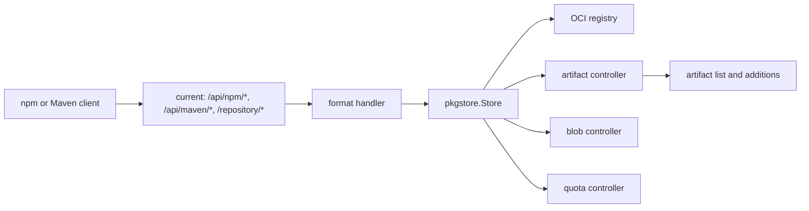
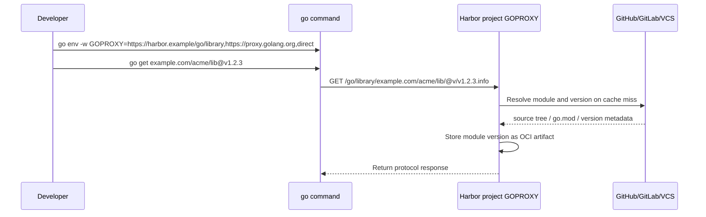
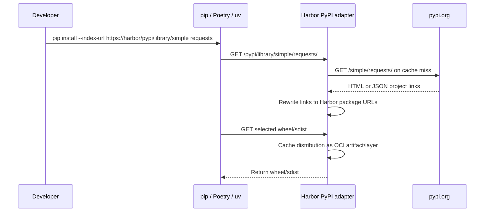
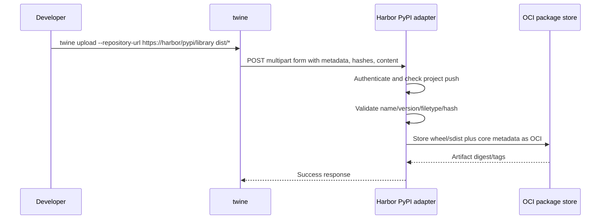
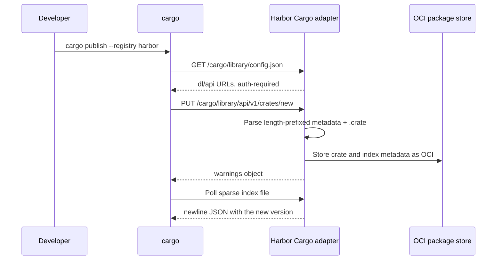
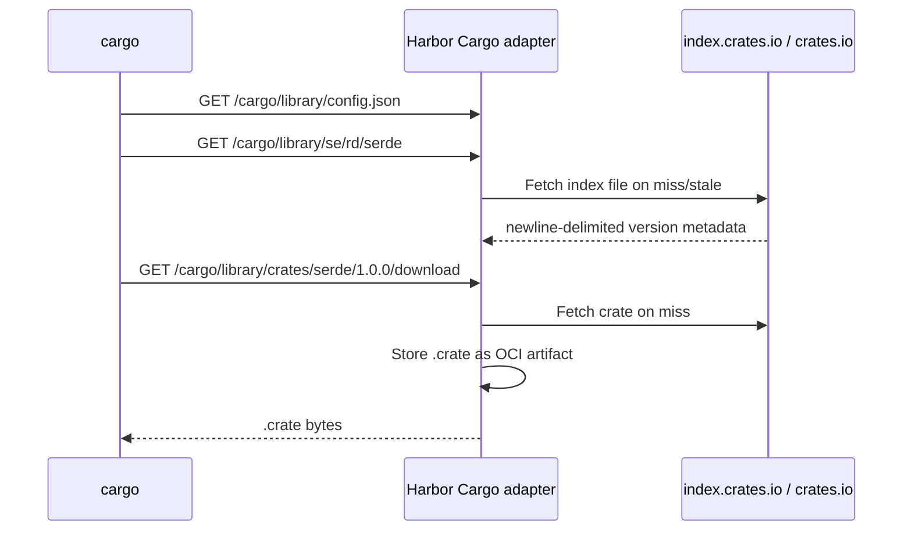
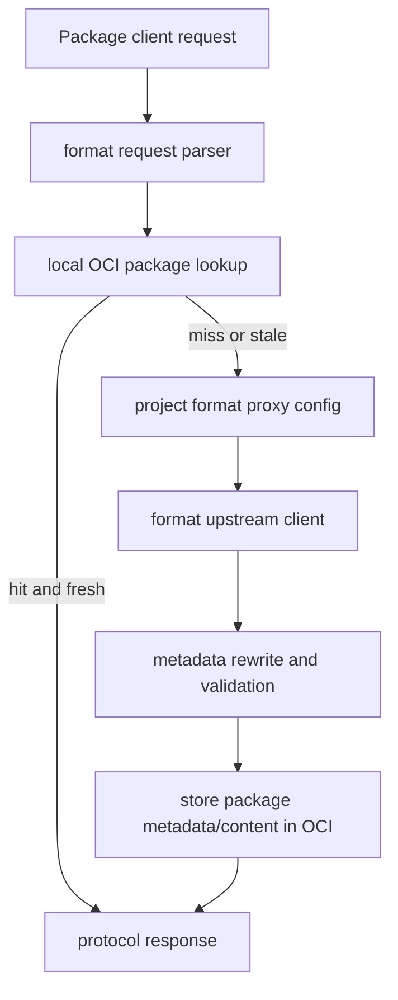

# Go, PyPI, and Cargo Registry Support Research

Status: exploration draft
Audience: Harbor Next maintainers discussing package-registry support
Scope: Go modules, Python/PyPI packages, Rust/Cargo crates, and a reusable pattern for future package formats

## Executive Summary

Supporting Go, PyPI, and Cargo packages in Harbor is feasible, but the clean Harbor-shaped implementation should not blindly copy Nexus's "one repository object per format/type" model. Harbor projects are already multi-format namespaces, and this fork already stores npm and Maven packages as OCI artifacts through `src/server/registry/pkgstore`. The strongest path is:

1. Keep Harbor projects as multi-format storage and permission boundaries.
2. Add package-manager protocol adapters for Go, PyPI, and Cargo under dedicated package roots such as `/pypi/{project}/...`, `/cargo/{project}/...`, and `/go/{project}/...`. Existing npm/Maven currently expose `/api/npm/*`, `/api/maven/*`, and `/repository/*`, but a separate refactor is expected to simplify them to `/npm/*` and `/maven/*`.
3. Store every published/cached package version as an OCI image manifest with a small Harbor package config blob, one or more package content layers, and format-specific metadata layers.
4. Keep a clear distinction between hosted package support and proxy-cache package support, even when both live under the same Harbor project model.
5. Defer Nexus/JFrog-style group or virtual repositories unless we intentionally add aggregation semantics later. Harbor's default project experience is already "one project can contain many package formats", and Go already has multi-proxy fallback through `GOPROXY`.

The first implementation should be hosted support for a package manager that already has a native publish protocol, most likely PyPI or Cargo. Go should move to the proxy-cache milestone first: the standard `go` command consumes modules through GOPROXY, but it does not publish modules to a registry. Hosted Go support would require either Git/VCS hosting semantics or a Harbor-specific CLI flow that packages `.info`, `.mod`, and `.zip` content and uploads it.

## Sources Reviewed

| Area | Source | Notes |
|---|---|---|
| Sonatype Go | https://help.sonatype.com/en/go-repositories.html | Nexus supports Go proxy, hosted, and group; hosted is new in Nexus 3.93. |
| Sonatype PyPI | https://help.sonatype.com/en/pypi-repositories.html | Nexus supports proxy, hosted, and group; newer support includes PEP 658, PEP 691, PEP 700, and PEP 714 behavior. |
| Sonatype Cargo | https://help.sonatype.com/en/rust-cargo.html | Nexus supports hosted, proxy, group, sparse protocol, cargo publish, yank/unyank; no native cargo search. |
| Sonatype format design | https://help.sonatype.com/en/support-for-a-new-repository-format.html | Useful checklist: protocol, auth, proxy auth, component/asset mapping, metadata rewrite, search, maintenance tasks. |
| Nexus repository API | https://help.sonatype.com/en/repositories-api.html | Management endpoints are format/type-specific: `/service/rest/v1/repositories/{format}/{type}/{name}`. |
| Nexus generated API client | https://github.com/sonatype-nexus-community/nexus-repo-api-client-go | Confirms generated 3.93 API operations for `go`, `pypi`, and `cargo` hosted/proxy/group repositories. |
| JFrog PyPI | https://docs.jfrog.com/artifactory/docs/pypi-repositories | Local, remote, and virtual repos; pip/Poetry/uv/Twine flows. |
| JFrog Cargo | https://docs.jfrog.com/artifactory/docs/cargo-repositories | Sparse index, `sparse+` URLs, direct API crate upload, and remote proxy guidance. |
| JFrog Go | https://docs.jfrog.com/artifactory/docs/go-modules | Go proxy with mirror repository recommendations and checksum database proxying. |
| JFrog Create Repository API | https://docs.jfrog.com/artifactory/reference/createrepository | `PUT /artifactory/api/repositories/{repoKey}` creates local/remote/virtual repositories by config. |
| Go module proxy protocol | https://go.dev/ref/mod#module-proxies | Defines GOPROXY paths: list, info, mod, zip, latest. |
| Python Simple API | https://packaging.python.org/en/latest/specifications/simple-repository-api/ | Defines HTML and JSON Simple API, content negotiation, distribution metadata support. |
| PyPI upload API | https://docs.pypi.org/api/upload/ | Defines Twine-compatible multipart upload fields. |
| Cargo registry protocol | https://doc.rust-lang.org/cargo/reference/registries.html | Cargo supports git and sparse registry protocols. |
| Cargo registry index | https://doc.rust-lang.org/cargo/reference/registry-index.html | Defines index layout, `config.json`, sparse auth, crate metadata files, cache behavior. |
| Cargo registry web API | https://doc.rust-lang.org/cargo/reference/registry-web-api.html | Defines publish, yank, unyank, owner, search, and login endpoints. |
| OCI annotations | https://specs.opencontainers.org/image-spec/annotations/ | Use standard `org.opencontainers.image.*` annotations and Harbor-owned extension namespaces. |

Local code references:

| Area | Local path | Takeaway |
|---|---|---|
| npm route | `src/server/registry/npm/route.go` | Registers direct `/api/npm/*` and shared `/repository/*` handling. |
| Maven route | `src/server/registry/maven/route.go` | Same pattern as npm, with direct `/api/maven/*` and shared route matching. |
| Shared package route | `src/server/registry/pkgroute/route.go` | Dispatches package ecosystem handlers under `/repository/*`. |
| OCI package store | `src/server/registry/pkgstore/store.go` | Shared abstraction for package-as-OCI: config blob, layers, manifest, tags, quota, artifact ensure. |
| npm store | `src/server/registry/npm/store.go` | Stores npm package metadata and tarball using `pkgstore.Format`. |
| npm processor | `src/controller/artifact/processor/npm/npm.go` | Exposes dependencies, files, README, and license additions from OCI metadata/layers. |
| Maven processor | `src/controller/artifact/processor/maven/maven.go` | Shows richer package additions and layer role annotations. |
| Harbor REST API | `api/v2.0/swagger.yaml` | Source of truth for hosted/proxy management configuration APIs. |
| OCI proxy middleware | `src/server/middleware/repoproxy/proxy.go` | Existing proxy cache is OCI-registry-specific; package proxying needs a generic package proxy layer. |

## Terminology Mapping

| Concept | Nexus | JFrog | Harbor proposal |
|---|---|---|---|
| Internal write repository | Hosted | Local | Project accepts publish for all enabled package protocols. |
| Remote cache | Proxy | Remote | Project/format proxy config points to upstream and caches as OCI package artifacts. |
| Aggregated endpoint | Group | Virtual | Not required initially; could be a future project-level aggregation feature. |
| Repository object | Format + type + name | repoKey + package type + local/remote/virtual | Harbor project remains the namespace; package name becomes repository path inside the project. |
| Format API | `/repositories/{format}/{type}` | repository config JSON | Project metadata and future package-format config API. |
| Client protocol URL | `/repository/<repo-name>/...` | `/artifactory/api/<format>/<repo>/...` | Dedicated package roots such as `/pypi/<project>/...`, `/cargo/<project>/...`, `/go/<project>/...`; existing npm/Maven are being refactored toward `/npm/*` and `/maven/*`. |

## Existing Harbor Shape

The fork already has a strong foundation, but its current package routes are transitional:



Current route state:

| Format | Current direct route | Current shared route | Expected route direction |
|---|---|---|---|
| OCI artifacts | `/v2/*` | None | Keep `/v2/*`; this is the Docker/OCI Distribution API. |
| ChartMuseum/Helm chart repo | `/chartrepo/*` in upstream Harbor patterns | None | Keep its own protocol route where present. |
| npm | `/api/npm/{project}/...` | `/repository/{project}/...` | Refactor to `/npm/{project}/...`. |
| Maven | `/api/maven/{project}/...` | `/repository/{project}/...` | Refactor to `/maven/{project}/...`. |
| Homebrew | None | None | No Homebrew registry protocol route today; Homebrew bottles are detected as OCI artifacts. |
| PyPI | Not implemented | Not implemented | Add `/pypi/{project}/...`. |
| Cargo | Not implemented | Not implemented | Add `/cargo/{project}/...`. |
| Go | Not implemented | Not implemented | Add `/go/{project}/...` for proxy-cache support later. |

Dedicated package roots are better than a generic `/repository/*` multiplexer for production use because they avoid route collisions, remove format guessing, reduce unnecessary parser work, make logs/metrics easier to segment, and keep each package manager's wire protocol visibly separate from Harbor's REST API.

The important point is that `pkgstore.Store` already models a package version as:

| OCI part | Current meaning |
|---|---|
| manifest artifact type | Format marker, for example `application/vnd.harbor.npm.package.v1`. |
| config blob | Harbor package metadata: package name, version, selected layer, all layers. |
| primary layer | Package artifact file: npm tarball, Maven jar/pom file group, etc. |
| extra layers | Files list, README, license, POM, or other additions. |
| tags | Version and aliases/dist-tags. |
| annotations | Common title/version plus layer role/title metadata. |

This is exactly the layer we should extend for Go, PyPI, and Cargo.

## Management API Comparison

### Nexus

Nexus exposes generic repository listing and then format/type-specific management endpoints. The generated 3.93 Go client contains operations such as:

| Format | Create | Get | Update |
|---|---|---|---|
| Go | `POST /v1/repositories/go/{hosted,proxy,group}` | `GET /v1/repositories/go/{hosted,proxy,group}/{repositoryName}` | `PUT /v1/repositories/go/{hosted,proxy,group}/{repositoryName}` |
| PyPI | `POST /v1/repositories/pypi/{hosted,proxy,group}` | `GET /v1/repositories/pypi/{hosted,proxy,group}/{repositoryName}` | `PUT /v1/repositories/pypi/{hosted,proxy,group}/{repositoryName}` |
| Cargo | `POST /v1/repositories/cargo/{hosted,proxy,group}` | `GET /v1/repositories/cargo/{hosted,proxy,group}/{repositoryName}` | `PUT /v1/repositories/cargo/{hosted,proxy,group}/{repositoryName}` |

Common model fields include `name`, `online`, `storage.blobStoreName`, `storage.strictContentTypeValidation`, `storage.writePolicy`, `proxy.remoteUrl`, `proxy.contentMaxAge`, `proxy.metadataMaxAge`, `negativeCache.enabled`, `negativeCache.timeToLive`, and group member names.

### JFrog

JFrog exposes a generic repository config endpoint:

```text
PUT /artifactory/api/repositories/{repoKey}
```

The payload chooses local, remote, virtual, or federated semantics, plus package-type settings. Its package client URLs are format-specific, for example:

| Format | JFrog client URL examples |
|---|---|
| PyPI | `/artifactory/api/pypi/<repo>/simple` for installs, `/artifactory/api/pypi/<repo>` for publish config. |
| Cargo | `sparse+.../artifactory/api/cargo/<repo>/index/` for sparse index. |
| Go | Artifactory acts as GOPROXY and can proxy `proxy.golang.org`, VCS providers, and `sum.golang.org`. |

### Harbor Recommendation

Do not add Nexus-style `hosted/proxy/group` repository objects as the primary Harbor storage model. Instead, keep Harbor projects as the namespace and expose typed management configuration through the Harbor REST API:

| Need | Suggested Harbor API |
|---|---|
| Read enabled package formats for a project | `GET /api/v2.0/projects/{project_name_or_id}/package-formats` |
| Configure hosted behavior for a project/format | `PUT /api/v2.0/projects/{project_name_or_id}/package-hosted/{format}` |
| Configure proxy behavior for a project/format | `PUT /api/v2.0/projects/{project_name_or_id}/package-proxies/{format}` |
| Read hosted/proxy config | `GET /api/v2.0/projects/{project_name_or_id}/package-{hosted,proxies}/{format}` |
| Delete hosted/proxy config | `DELETE /api/v2.0/projects/{project_name_or_id}/package-{hosted,proxies}/{format}` |
| Package protocol routes | Dedicated package roots, for example `/pypi/{project}/...`, `/cargo/{project}/...`, `/go/{project}/...` |
| Artifact browsing | Existing artifact/repository APIs, with added package artifact types and additions |

This keeps Harbor's project model intact while still providing automation-friendly configuration.

Example hosted config object:

```json
{
  "format": "pypi",
  "enabled": true,
  "mode": "hosted",
  "online": true,
  "allow_overwrite": false
}
```

Example proxy config object:

```json
{
  "format": "pypi",
  "enabled": true,
  "mode": "proxy",
  "remote_url": "https://pypi.org",
  "content_cache_ttl_minutes": 1440,
  "metadata_cache_ttl_minutes": 60,
  "negative_cache_ttl_minutes": 15,
  "auth": {
    "credential_id": "project-secret-ref"
  },
  "online": true
}
```

Open decision: the exact model shape is still open, but management/configuration APIs should be added through Swagger rather than hidden in ad hoc project metadata.

## Package Protocol Requirements

### Go Modules

The Go client uses `GOPROXY`. A module proxy is a simple HTTP server responding to `GET` requests:

| Endpoint under base | Response |
|---|---|
| `/{module}/@v/list` | Plain text list of versions, one per line. |
| `/{module}/@v/{version}.info` | JSON object with `Version` and optional RFC3339 `Time`. |
| `/{module}/@v/{version}.mod` | `go.mod` content, or synthesized `module <path>` when absent. |
| `/{module}/@v/{version}.zip` | Canonical Go module zip. |
| `/{module}/@latest` | Optional latest-version metadata. |

Client behavior to preserve:

| Behavior | Harbor implication |
|---|---|
| 404/410 allow fallback to the next GOPROXY entry. | Proxy miss behavior must be intentional; do not convert upstream policy denials into 404 if Harbor is acting as a gatekeeper. |
| Module paths and versions are case-encoded with `!` for uppercase. | Route parsing and storage keys must use Go's escaped module path rules. |
| `GONOSUMDB` and `GOPRIVATE` control checksum database behavior. | Docs should show users how to set `GONOSUMDB` for private modules. |
| Go checks content with `go.sum` and checksum DB by default. | Cached/proxied content must be immutable by module version. |

Suggested Harbor routes:

```text
GET /go/{project}/{module}/@v/list
GET /go/{project}/{module}/@v/{version}.info
GET /go/{project}/{module}/@v/{version}.mod
GET /go/{project}/{module}/@v/{version}.zip
GET /go/{project}/{module}/@latest
```

Hosted publish is not native in the `go` CLI in the same way as `npm publish`, `twine upload`, or `cargo publish`. Nexus's hosted Go support stores module zip files, but Harbor should not start with hosted Go unless we first define a producer workflow. There are two plausible hosted Go designs:

| Hosted Go option | Meaning | Tradeoff |
|---|---|---|
| Git/VCS hosting | Harbor hosts Git repositories or speaks enough VCS protocol for `go` to discover modules. | Large scope; turns Harbor into a source host. |
| Harbor CLI pack-and-push | A `harbor-cli` command builds canonical `.info`, `.mod`, and `.zip` files and uploads them to Harbor. | Smaller scope, but non-standard because the Go CLI does not publish modules. |

For now, Go should be deferred until the proxy-cache milestone. The first Go goal should be direct proxying of VCS/module sources, not proxying `proxy.golang.org` as the default. Users can already express chained fallback with `GOPROXY`, for example:

```text
GOPROXY=https://harbor.example/go/library,https://proxy.golang.org,direct
```

That means Harbor does not need a Go "group repository" concept for the initial design. Go's client-side fallback already handles multiple proxies.

User flow:



Checksum database caching is optional and separate from module content proxying. Nexus recommends a raw proxy repository with remote URL `https://sum.golang.org` and strict content type validation disabled. In Harbor terms this suggests one of two future approaches:

| Approach | Meaning | Fit |
|---|---|---|
| Raw proxy-cache registry | Add a generic raw proxy format and configure one project proxy to `https://sum.golang.org`. | Reusable beyond Go; closer to Nexus's recommendation. |
| Go checksum proxy mode | Treat checksum DB endpoints as part of `/go/{project}/sumdb/...` or a related Go proxy config. | Better integrated for Go users, but less generic. |

This should be explicit in the proxy design because checksum DB caching has different validation and content-type behavior than module zip/mod/info caching.

### PyPI

PyPI has two separate surfaces:

| Surface | Main clients | Required endpoints |
|---|---|---|
| Simple Repository API | pip, Poetry, uv | Project list, project detail, file links, optional JSON negotiation, metadata sidecars. |
| Upload API | Twine, Poetry publish, uv publish | Multipart `POST` with `:action=file_upload`, package metadata fields, hashes, and content. |

Modern compatibility targets:

| Spec behavior | Harbor implication |
|---|---|
| PEP 503 HTML Simple API remains baseline. | Must serve HTML project pages for older pip. |
| PEP 691 JSON Simple API uses `Accept` content negotiation. | Should implement JSON early if targeting uv/Poetry/pip modern behavior. |
| PEP 658/714 metadata links expose `.metadata` without downloading wheels. | Store core metadata as a layer so HTML and JSON can expose hashes/sidecars. |
| Upload API uploads one file at a time. | A package version may have multiple distribution files. Store each distribution as related layers or related artifact entries. |
| Name normalization matters. | Use Python normalized names for lookup, preserve display name in metadata. |

Suggested Harbor routes:

```text
GET  /pypi/{project}/simple/
GET  /pypi/{project}/simple/{normalized_project}/
GET  /pypi/{project}/packages/{filename}
GET  /pypi/{project}/packages/{filename}.metadata
HEAD /pypi/{project}/packages/{filename}
POST /pypi/{project}/
```

User flow:



Publish flow:



### Cargo

Cargo has an index protocol and a web API. Sparse index support should be the Harbor default; git index support is not worth implementing initially.

Sparse index requirements:

| Endpoint/data | Purpose |
|---|---|
| `/config.json` | Tells Cargo where to download crates and where the API lives; may set `auth-required`. |
| Index package file | One newline-delimited JSON object per version. Paths are determined from crate name. |
| Download endpoint | Returns `.crate` tarball. |
| HTTP caching | Should support `ETag` or `Last-Modified`, and return `304` where possible. |

Web API requirements:

| Endpoint | Method | Purpose |
|---|---|---|
| `/api/v1/crates/new` | `PUT` | Publish new crate. Body is length-prefixed JSON metadata plus `.crate` bytes. |
| `/api/v1/crates/{crate}/{version}/yank` | `DELETE` | Mark version yanked in index. |
| `/api/v1/crates/{crate}/{version}/unyank` | `PUT` | Clear yanked flag. |
| `/api/v1/crates` | `GET` | Search. Nexus does not support native Cargo search; we can defer too. |

Suggested Harbor routes:

```text
GET    /cargo/{project}/config.json
GET    /cargo/{project}/{crate_index_path}
GET    /cargo/{project}/crates/{crate}/{version}/download
HEAD   /cargo/{project}/crates/{crate}/{version}/download
PUT    /cargo/{project}/api/v1/crates/new
DELETE /cargo/{project}/api/v1/crates/{crate}/{version}/yank
PUT    /cargo/{project}/api/v1/crates/{crate}/{version}/unyank
```

The `/cargo/{project}/...` root is short enough for Cargo sparse URLs and avoids the generic `/repository/*` multiplexer.

User flow:



Proxy flow:



## OCI Storage Proposal

Use one common package config media type, then format-specific artifact and layer media types.

Recommended storage granularity:

| Format | Artifact granularity | Reason |
|---|---|---|
| PyPI | One OCI artifact per package version, with one layer per uploaded distribution file. | A PyPI version can contain several wheels plus an sdist; Twine uploads files one at a time, so the handler should upsert the version artifact and append/replace distribution layers by filename. |
| Cargo | One OCI artifact per crate version. | Cargo publishes one `.crate` archive per crate/version and one index entry for that version. |
| Go | One OCI artifact per module version when proxy-cache or future hosted Go is implemented. | GOPROXY serves `.info`, `.mod`, and `.zip` for a module/version as one immutable unit. |

### Common Manifest

```json
{
  "schemaVersion": 2,
  "mediaType": "application/vnd.oci.image.manifest.v1+json",
  "artifactType": "application/vnd.harbor.pypi.package.v1",
  "config": {
    "mediaType": "application/vnd.harbor.package.config.v1+json",
    "digest": "sha256:...",
    "size": 1234
  },
  "layers": [
    {
      "mediaType": "application/vnd.harbor.pypi.distribution.whl.v1",
      "digest": "sha256:...",
      "size": 12345,
      "annotations": {
        "org.opencontainers.image.title": "demo-1.0.0-py3-none-any.whl",
        "io.goharbor.package.layer.role": "distribution"
      }
    }
  ],
  "annotations": {
    "org.opencontainers.image.title": "demo",
    "org.opencontainers.image.version": "1.0.0",
    "org.opencontainers.artifactType": "application/vnd.harbor.pypi.package.v1",
    "io.goharbor.package.format": "pypi",
    "io.goharbor.package.name": "demo",
    "io.goharbor.package.version": "1.0.0"
  }
}
```

### Common Config Blob

All package artifacts should use `application/vnd.harbor.package.config.v1+json` for the OCI config blob. The config should carry structured metadata that processors and protocol handlers can read without re-parsing every content layer:

```json
{
  "format": "pypi",
  "name": "demo",
  "normalized_name": "demo",
  "version": "1.0.0",
  "source_mode": "hosted",
  "metadata": {
    "summary": "Example package",
    "license": "Apache-2.0"
  },
  "layers": [
    {
      "role": "distribution",
      "title": "demo-1.0.0-py3-none-any.whl",
      "media_type": "application/vnd.harbor.pypi.distribution.whl.v1",
      "digest": "sha256:...",
      "size": 12345,
      "sha256": "..."
    }
  ]
}
```

Common config fields:

| Field | Meaning |
|---|---|
| `format` | Package ecosystem: `pypi`, `cargo`, `go`. |
| `name` | Display/canonical package name from the package manager. |
| `normalized_name` | Lookup key used by protocol handlers. For PyPI this is the normalized project name; for Cargo this is lowercase crate name; for Go this is the escaped module path. |
| `version` | Package-manager version string. |
| `source_mode` | `hosted`, `proxy`, or future `mirrored`. |
| `upstream` | Optional upstream URL/cache validators for proxy-cache artifacts. |
| `metadata` | Format-specific parsed metadata used by additions and UI. |
| `layers` | Layer inventory with role, media type, digest, size, title, and package-manager checksums. |

### Proposed Media Types

| Format | Artifact type | Primary layer types | Metadata layer types |
|---|---|---|---|
| PyPI | `application/vnd.harbor.pypi.package.v1` | `application/vnd.harbor.pypi.distribution.whl.v1`, `application/vnd.harbor.pypi.distribution.sdist.v1` | `application/vnd.harbor.pypi.core-metadata.v1`, `application/vnd.harbor.pypi.simple.v1+json` |
| Cargo | `application/vnd.harbor.cargo.crate.v1` | `application/vnd.harbor.cargo.crate.layer.v1` | `application/vnd.harbor.cargo.index-entry.v1+json`, `application/vnd.harbor.cargo.manifest.v1+toml` |
| Go | `application/vnd.harbor.golang.module.v1` | `application/vnd.harbor.golang.module.zip.v1`, `application/vnd.harbor.golang.mod.v1` | `application/vnd.harbor.golang.info.v1+json`, optional `application/vnd.harbor.golang.version-list.v1` |

### Proposed Annotations

Use OCI standard keys where they fit:

| Annotation | Use |
|---|---|
| `org.opencontainers.image.title` | Human package name or layer filename. |
| `org.opencontainers.image.version` | Package version. |
| `org.opencontainers.image.source` | Upstream source repository where known. |
| `org.opencontainers.image.url` | Package homepage/documentation URL where known. |
| `org.opencontainers.image.licenses` | License expression where known. |
| `org.opencontainers.artifactType` | Artifact type marker already used by local code. |

Use Harbor-owned annotations for package-specific metadata:

| Annotation | Use |
|---|---|
| `io.goharbor.package.format` | `go`, `pypi`, `cargo`. |
| `io.goharbor.package.name` | Canonical package name. |
| `io.goharbor.package.version` | Canonical package version. |
| `io.goharbor.package.normalized-name` | PyPI normalized name or Cargo lowercase key. |
| `io.goharbor.package.layer.role` | `distribution`, `metadata`, `index`, `mod`, `info`, `readme`, `license`. |
| `io.goharbor.package.upstream.url` | Source URL for proxied artifacts. |
| `io.goharbor.package.upstream.etag` | Upstream cache validator. |
| `io.goharbor.package.upstream.last-modified` | Upstream cache validator. |
| `io.goharbor.package.checksum.sha256` | Package-manager checksum. |
| `io.goharbor.package.yanked` | Cargo/PyPI yanked state where relevant. |

Avoid inventing annotations under `org.opencontainers.*` beyond defined OCI keys.

### Layer Roles

Use `io.goharbor.package.layer.role` on every non-config layer. Common roles:

| Role | Meaning |
|---|---|
| `distribution` | Installable package file: wheel, sdist, crate, module zip. |
| `metadata` | Package-manager metadata sidecar that is not itself installable. |
| `index` | Registry index entry/page used by the package manager. |
| `manifest` | Extracted package manifest such as `Cargo.toml`. |
| `mod` | Go `go.mod` file. |
| `info` | Go version `.info` JSON. |
| `readme` | README content extracted from package metadata/archive. |
| `license` | License file/content extracted from package metadata/archive. |
| `files` | File inventory JSON for UI additions. |

Layer role annotations should be stable enough for `pkgstore.Upsert` to replace a prior layer with the same semantic identity. Use `org.opencontainers.image.title` as the primary identity for file-like layers and `io.goharbor.package.layer.role` for single-role metadata layers.

### PyPI OCI Layout

PyPI should use a version-level artifact:

```text
repository: {project}/{normalized_name}
tag:        {version}
artifact:   application/vnd.harbor.pypi.package.v1
config:     application/vnd.harbor.package.config.v1+json
```

Recommended PyPI layers:

| Role | Media type | Title annotation | Extra annotations |
|---|---|---|---|
| `distribution` | `application/vnd.harbor.pypi.distribution.whl.v1` | Wheel filename | `io.goharbor.pypi.package-type=bdist_wheel`, `io.goharbor.package.checksum.sha256`, optional `io.goharbor.pypi.python-tag`, `io.goharbor.pypi.abi-tag`, `io.goharbor.pypi.platform-tag` |
| `distribution` | `application/vnd.harbor.pypi.distribution.sdist.v1` | Sdist filename | `io.goharbor.pypi.package-type=sdist`, `io.goharbor.package.checksum.sha256` |
| `metadata` | `application/vnd.harbor.pypi.core-metadata.v1` | `METADATA` | `io.goharbor.package.layer.role=metadata` |
| `readme` | `application/vnd.harbor.package.doc.v1.raw` | `README` | `io.goharbor.package.layer.role=readme`, optional content type |
| `license` | `application/vnd.harbor.package.doc.v1.raw` | `LICENSE` | `io.goharbor.package.layer.role=license`, optional content type |
| `files` | `application/vnd.harbor.package.files.v1+json` | `files.json` | File inventory for the Harbor UI |

PyPI manifest annotations:

```json
{
  "org.opencontainers.image.title": "demo",
  "org.opencontainers.image.version": "1.0.0",
  "org.opencontainers.image.licenses": "Apache-2.0",
  "org.opencontainers.artifactType": "application/vnd.harbor.pypi.package.v1",
  "io.goharbor.package.format": "pypi",
  "io.goharbor.package.name": "demo",
  "io.goharbor.package.normalized-name": "demo",
  "io.goharbor.package.version": "1.0.0"
}
```

Example PyPI layers:

```json
[
  {
    "mediaType": "application/vnd.harbor.pypi.distribution.whl.v1",
    "digest": "sha256:...",
    "size": 48211,
    "annotations": {
      "org.opencontainers.image.title": "demo-1.0.0-py3-none-any.whl",
      "io.goharbor.package.layer.role": "distribution",
      "io.goharbor.pypi.package-type": "bdist_wheel",
      "io.goharbor.package.checksum.sha256": "..."
    }
  },
  {
    "mediaType": "application/vnd.harbor.pypi.core-metadata.v1",
    "digest": "sha256:...",
    "size": 2048,
    "annotations": {
      "org.opencontainers.image.title": "METADATA",
      "io.goharbor.package.layer.role": "metadata"
    }
  }
]
```

PyPI config metadata should include `summary`, `description_content_type`, `requires_python`, `classifiers`, `project_urls`, `dependencies`, `provides_extra`, and a `distributions` array with filename, package type, size, hashes, upload time, and yanked status. This lets the Simple API handler render HTML/JSON without pulling every distribution blob.

### Cargo OCI Layout

Cargo should use one artifact per crate version:

```text
repository: {project}/{crate_name}
tag:        {version}
artifact:   application/vnd.harbor.cargo.crate.v1
config:     application/vnd.harbor.package.config.v1+json
```

Recommended Cargo layers:

| Role | Media type | Title annotation | Extra annotations |
|---|---|---|---|
| `distribution` | `application/vnd.harbor.cargo.crate.layer.v1` | `{crate}-{version}.crate` | `io.goharbor.package.checksum.sha256`, optional `io.goharbor.cargo.checksum` |
| `index` | `application/vnd.harbor.cargo.index-entry.v1+json` | `index-entry.json` | `io.goharbor.package.layer.role=index` |
| `manifest` | `application/vnd.harbor.cargo.manifest.v1+toml` | `Cargo.toml` | `io.goharbor.package.layer.role=manifest` |
| `readme` | `application/vnd.harbor.package.doc.v1.raw` | README filename | `io.goharbor.package.layer.role=readme` |
| `license` | `application/vnd.harbor.package.doc.v1.raw` | LICENSE filename | `io.goharbor.package.layer.role=license` |
| `files` | `application/vnd.harbor.package.files.v1+json` | `files.json` | File inventory for the Harbor UI |

Cargo manifest annotations:

```json
{
  "org.opencontainers.image.title": "serde",
  "org.opencontainers.image.version": "1.0.203",
  "org.opencontainers.image.licenses": "MIT OR Apache-2.0",
  "org.opencontainers.artifactType": "application/vnd.harbor.cargo.crate.v1",
  "io.goharbor.package.format": "cargo",
  "io.goharbor.package.name": "serde",
  "io.goharbor.package.normalized-name": "serde",
  "io.goharbor.package.version": "1.0.203",
  "io.goharbor.package.yanked": "false"
}
```

Cargo config metadata should include the exact sparse index entry fields: `name`, `vers`, `deps`, `cksum`, `features`, `features2`, `yanked`, `links`, and `rust_version`. The `/cargo/{project}/{crate_index_path}` handler should render newline-delimited JSON entries from this metadata, not re-open crate archives on each request.

Example Cargo layers:

```json
[
  {
    "mediaType": "application/vnd.harbor.cargo.crate.layer.v1",
    "digest": "sha256:...",
    "size": 78120,
    "annotations": {
      "org.opencontainers.image.title": "serde-1.0.203.crate",
      "io.goharbor.package.layer.role": "distribution",
      "io.goharbor.package.checksum.sha256": "..."
    }
  },
  {
    "mediaType": "application/vnd.harbor.cargo.index-entry.v1+json",
    "digest": "sha256:...",
    "size": 1200,
    "annotations": {
      "org.opencontainers.image.title": "index-entry.json",
      "io.goharbor.package.layer.role": "index"
    }
  }
]
```

Yank and unyank should update config metadata and the `index` layer using `pkgstore.Upsert`, keeping the same crate tarball layer.

### Go OCI Layout

Go support should be proxy-cache/direct first, but the storage unit is still clear: one artifact per module version.

```text
repository: {project}/{escaped_module_path}
tag:        {escaped_version}
artifact:   application/vnd.harbor.golang.module.v1
config:     application/vnd.harbor.package.config.v1+json
```

Recommended Go layers:

| Role | Media type | Title annotation | Extra annotations |
|---|---|---|---|
| `distribution` | `application/vnd.harbor.golang.module.zip.v1` | `{module}@{version}.zip` | `io.goharbor.package.checksum.sha256`, optional `io.goharbor.golang.sum` |
| `mod` | `application/vnd.harbor.golang.mod.v1` | `{version}.mod` | `io.goharbor.package.layer.role=mod` |
| `info` | `application/vnd.harbor.golang.info.v1+json` | `{version}.info` | `io.goharbor.package.layer.role=info` |
| `metadata` | `application/vnd.harbor.golang.version-list.v1` | `list` | Optional cached version list metadata |
| `files` | `application/vnd.harbor.package.files.v1+json` | `files.json` | Optional file inventory for the Harbor UI |

Go manifest annotations:

```json
{
  "org.opencontainers.image.title": "github.com/acme/lib",
  "org.opencontainers.image.version": "v1.2.3",
  "org.opencontainers.image.source": "https://github.com/acme/lib",
  "org.opencontainers.artifactType": "application/vnd.harbor.golang.module.v1",
  "io.goharbor.package.format": "go",
  "io.goharbor.package.name": "github.com/acme/lib",
  "io.goharbor.package.normalized-name": "github.com/acme/lib",
  "io.goharbor.package.version": "v1.2.3"
}
```

Example Go layers:

```json
[
  {
    "mediaType": "application/vnd.harbor.golang.info.v1+json",
    "digest": "sha256:...",
    "size": 74,
    "annotations": {
      "org.opencontainers.image.title": "v1.2.3.info",
      "io.goharbor.package.layer.role": "info"
    }
  },
  {
    "mediaType": "application/vnd.harbor.golang.mod.v1",
    "digest": "sha256:...",
    "size": 192,
    "annotations": {
      "org.opencontainers.image.title": "v1.2.3.mod",
      "io.goharbor.package.layer.role": "mod"
    }
  },
  {
    "mediaType": "application/vnd.harbor.golang.module.zip.v1",
    "digest": "sha256:...",
    "size": 92144,
    "annotations": {
      "org.opencontainers.image.title": "github.com/acme/lib@v1.2.3.zip",
      "io.goharbor.package.layer.role": "distribution",
      "io.goharbor.package.checksum.sha256": "..."
    }
  }
]
```

Go config metadata should include `module`, `escaped_module`, `version`, `escaped_version`, `time`, `origin_vcs`, `origin_url`, `origin_ref`, and optional checksum DB state. If checksum DB caching is implemented as raw proxy, do not mix sumdb response bodies into the module artifact; keep them in the raw proxy cache.

## Package-to-Repository Naming

The package-manager route root must not be injected into the stored Harbor repository name. A client may talk to `https://harbor/pypi/library/simple/requests/`, but the artifact should be stored under the Harbor repository `library/requests`, not `library/pypi/requests`.

The intended storage rule is:

```text
{project}/{normalized_package_or_repo_path}
```

Examples:

| Format | Example package | Harbor repository |
|---|---|---|
| Go | `github.com/acme/lib` | `library/github.com/acme/lib` |
| PyPI | `Requests` normalized to `requests` | `library/requests` |
| Cargo | `serde` | `library/serde` |
| npm | `@scope/pkg` | `library/scope/pkg` or current npm-normalized equivalent |
| Maven | `com.acme:demo` | `library/com/acme/demo` |

Format identity should come from artifact metadata, media types, annotations, and processors, not from a forced path segment in the repository name. This preserves the Harbor model where a project is multi-format and repository names remain package names.

Collision note: two ecosystems can theoretically use the same repository path in the same project, for example PyPI `requests` and a Cargo crate named `requests`. Harbor should first rely on artifact type/media type to distinguish the artifacts in that repository. If this causes UI or policy problems later, solve it with package-aware listing/filtering, not by injecting package-manager route names into storage paths.

## Proxy Architecture

The current `repoproxy` middleware is OCI-specific; it operates on manifests/blobs. Package proxying needs a shared package proxy service above `pkgstore`, with format adapters for metadata rewrite and upstream fetch.



Shared package proxy service should provide:

| Capability | Why |
|---|---|
| Remote URL and credentials | Needed for private upstream PyPI/Cargo/Go sources. |
| Metadata TTL and content TTL | Nexus and JFrog both distinguish metadata freshness from artifact content. |
| Negative cache | Avoid repeated upstream 404s for typos and resolver backtracking. |
| In-flight request coalescing | Avoid thundering herds on popular package versions. Existing `controller/proxy/inflight.go` may be reusable. |
| Conditional upstream requests | Use `ETag`/`Last-Modified` for PyPI/Cargo metadata and package downloads. |
| URL rewrite | PyPI simple pages and Cargo `config.json` need Harbor URLs, not upstream URLs. |
| Policy errors | 403 vs 404 behavior matters for Go fallback and private package governance. |

### Hosted vs Proxy Distinction

Harbor should expose hosted and proxy-cache as explicit modes in management config even if both modes can store data in the same project:

| Mode | Meaning | First formats |
|---|---|---|
| Hosted | Harbor is the authoritative package registry for uploads from package-manager CLIs. | PyPI and Cargo. |
| Proxy cache | Harbor reads from an upstream registry/source and stores fetched package content locally. | Later PyPI, Cargo, Go direct, and optional raw checksum DB proxy. |
| Group/virtual | One endpoint aggregates several hosted/proxy sources. | Not in scope initially. |

This distinction matters for enterprise operation because retention, immutability, audit events, quota accounting, RBAC, upstream credentials, and cache invalidation behave differently for uploaded content versus cached content.

### Multi-Proxy Projects

A future Harbor project may need more than one package proxy configuration at the same time:

```json
{
  "project": "library",
  "package_proxies": [
    {"format": "pypi", "remote_url": "https://pypi.org/simple"},
    {"format": "cargo", "remote_url": "https://index.crates.io"},
    {"format": "go", "remote_url": "direct"},
    {"format": "raw", "remote_url": "https://sum.golang.org", "purpose": "go-sumdb"}
  ]
}
```

That is different from a Nexus group repository. A multi-proxy Harbor project would keep one project namespace and one permission boundary, while each package format still has its own protocol root and upstream policy. This is a good future direction, but the first implementation should not require it.

## Swagger Boundary

Swagger remains the source of truth for Harbor's REST management API under `/api/v2.0`. It should not become the source of truth for package-manager CLI protocol routes such as `/npm`, `/maven`, `/pypi`, `/cargo`, or `/go`.

The package-manager routes are not meant for the average Harbor API consumer. They are compatibility endpoints for existing external CLIs such as `npm`, Maven, `pip`, `twine`, `cargo`, and `go`. They often need arbitrary path tails, non-JSON responses, streaming blobs, checksum sidecars, content negotiation, and package-manager-specific auth conventions. Forcing these through generated Swagger handlers would add codegen layers without giving much value, and it would make protocol compatibility work harder.

The current npm and Maven implementations already use the right pattern for protocol routes: they are hand-registered under `src/server/registry/npm`, `src/server/registry/maven`, and `src/server/registry/pkgroute`, while `/api/v2.0/*` is generated from Swagger. The refactor should keep that model but simplify route roots to `/npm` and `/maven`, then add new package managers the same way under `src/server/registry/<format>`.

The practical rule:

1. Do not add package CLI protocol routes to `api/v2.0/swagger.yaml`.
2. Implement package CLI routes as custom handlers under `src/server/registry/<format>`.
3. Cover package CLI routes with protocol-level tests, conformance fixtures, auth/RBAC tests, metrics, and audit events.
4. Use Swagger only for Harbor-owned REST management/config APIs, such as enabling hosted/proxy mode or configuring upstreams.

The rule should be:

| Route class | Examples | Source of truth |
|---|---|---|
| Harbor REST management API | `/api/v2.0/projects/{id}/package-proxies/{format}` | `api/v2.0/swagger.yaml` plus generated handlers. |
| Package-manager protocol API | `/pypi/{project}/simple/{name}/`, `/cargo/{project}/config.json`, `/go/{project}/{module}/@v/list` | Custom `src/server/registry/<format>` handler, format tests, and protocol docs. Not generated from Swagger. |
| OCI Distribution API | `/v2/*` | Distribution-spec-compatible router and middleware. |

Swagger should cover only Harbor-owned management and browsing extensions:

| Area | Swagger change |
|---|---|
| Project package format config | Add typed hosted/proxy config models/endpoints. |
| Artifact models | Ensure artifact type values and addition links work for `GO`, `PYPI`, `CARGO`. |
| Package additions | Existing `GET /projects/{project}/repositories/{repository}/artifacts/{reference}/additions/{addition}` can serve new additions. |
| Search/filter | Existing artifact list can filter by `artifact_type` or `media_type`; we may add examples/docs rather than new endpoints. |

The commercial/enterprise argument for this split is scalability and compatibility: custom protocol handlers keep the package-manager surface close to the CLI expectations and localize package-specific complexity in one package. Generated REST handlers remain useful for Harbor-owned JSON APIs with stable schemas. The protocol routes can still be production-grade through route-specific tests, conformance fixtures, auth/RBAC middleware, audit events, metrics, and documentation.

Suggested addition types:

| Format | Addition types |
|---|---|
| Go | `GO.MOD`, `INFO`, `DEPENDENCIES`, `FILES` |
| PyPI | `METADATA`, `DEPENDENCIES`, `FILES`, `README.MD`, `LICENSE` |
| Cargo | `CARGO.TOML`, `DEPENDENCIES`, `FEATURES`, `INDEX`, `README.MD`, `LICENSE` |

## Implementation Slices

### Slice 0: Shared Design Hardening

| Task | Notes |
|---|---|
| Keep storage repository naming format-neutral | Protocol roots identify the package manager; stored repositories remain `{project}/{package_or_repo_name}`. |
| Design Swagger-backed config schema | Hosted/proxy models, validation rules, and generated handlers. |
| Extract common auth/project authorization helper | npm and Maven duplicate project ID and Basic/Bearer auth logic. |
| Add shared package proxy cache metadata structs | Store TTL, upstream validators, negative cache. |

### Slice 1A: PyPI Hosted MVP

| Task | Notes |
|---|---|
| Register `src/server/registry/pypi` routes | Dedicated `/pypi/{project}/...` route. |
| Implement Twine upload API | Multipart `POST`, metadata fields, hashes, wheel/sdist validation. |
| Implement Simple HTML project endpoint | Enough for `pip install`. |
| Store distribution and metadata | One artifact per distribution file or one version artifact with multiple layers. |
| Add PyPI processor | Dependencies, metadata, files, readme/license. |

Open storage choice: PyPI version can have multiple files. A version-level artifact with multiple distribution layers is elegant, but repeated uploads require upsert and careful tag management. File-level artifacts are simpler but make package/version UI grouping harder.

### Slice 1B: Cargo Hosted MVP

| Task | Notes |
|---|---|
| Register `src/server/registry/cargo` routes | Dedicated `/cargo/{project}/...` route, sparse-only. |
| Serve `config.json` | Include `dl`, `api`, and `auth-required`. |
| Implement index file generation | Newline JSON from local OCI artifacts. |
| Implement publish endpoint | Parse length-prefixed metadata + `.crate`. |
| Implement download endpoint | Serve `.crate`. |
| Add yank/unyank | Update stored index metadata. |

Risk: Cargo polls index after publish; index consistency and cache headers need to be correct.

### Slice 2: Package Proxy Cache

| Task | Notes |
|---|---|
| Add proxy-cache registry config for package formats | Swagger-first management API under `/api/v2.0`. |
| Support PyPI and Cargo upstream proxying | Reuse hosted protocol roots but fetch/cache on miss. |
| Add Go direct proxying | Dedicated `/go/{project}/...` route; resolve module content from VCS/direct sources first. |
| Add optional raw checksum DB proxy | Remote `https://sum.golang.org`, strict content type validation disabled or not enforced. |
| Evaluate multi-proxy projects | One Harbor project with multiple package proxy configs. |

### Slice 3: Hosted Go, Only If Needed

| Task | Notes |
|---|---|
| Define upload producer | Either Harbor CLI pack-and-push or a broader VCS-hosting design. |
| Validate canonical module artifacts | Generate or verify `.info`, `.mod`, `.zip`. |
| Serve through GOPROXY protocol | Same read endpoints as Go proxy mode. |

## Recommended First Path

I would start with PyPI hosted if the goal is the simplest useful hosted package registry with an existing publish CLI. It exercises:

| Capability | Why it matters |
|---|---|
| Package protocol routing | Same pattern needed for all formats. |
| Native publish workflow | Twine and compatible clients already know how to upload. |
| OCI storage of non-container package versions | Core architecture proof. |
| Swagger-backed management config | Confirms the hosted/proxy mode model without adding proxy complexity. |

Then build Cargo hosted. After hosted support is solid, add proxy-cache support, starting with PyPI/Cargo and then Go direct proxying. Hosted Go should wait until Harbor has a clear CLI or VCS-hosting story.

## Open Questions for Discussion

1. How should the UI represent multiple package artifact types if different ecosystems share the same repository path?
2. What should the Swagger-backed hosted/proxy config schema look like for each package format?
3. For PyPI, should one package version with multiple distribution files be one OCI artifact with multiple layers, or one OCI artifact per distribution file?
4. For Go, should the first proxy mode support only direct VCS/module source resolution, or also `proxy.golang.org` as an upstream option?
5. For Cargo, do we want to support `cargo search`, or follow Nexus and defer native search?
6. Should all package formats use dedicated roots (`/npm`, `/maven`, `/pypi`, `/cargo`, `/go`) with no generic `/repository/*` route?
7. How strict should proxy policy be when upstream returns errors: should Harbor act as a gatekeeper with 403, or allow client fallback with 404/410?
8. Do package-manager tokens need a first-class Harbor token UX, or can basic auth/robot accounts cover the first version?
9. Should optional Go checksum DB caching be implemented as a raw proxy-cache format or as part of Go proxy configuration?

## Concrete Example End State

One Harbor project named `library` can contain:

| Ecosystem | Client config | Stored under |
|---|---|---|
| OCI image | `docker pull harbor/library/nginx:1.27` | `library/nginx` |
| npm | `npm config set registry https://harbor/npm/library/` | `library/<pkg>` |
| Maven | `<url>https://harbor/maven/library/</url>` | `library/<group>/<artifact>` |
| Go | `GOPROXY=https://harbor/go/library,https://proxy.golang.org,direct` | `library/<module>` |
| PyPI | `pip install --index-url https://harbor/pypi/library/simple <pkg>` | `library/<normalized-name>` |
| Cargo | `index = "sparse+https://harbor/cargo/library/"` | `library/<crate>` |

This preserves Harbor's multi-format project norm while giving each package manager its expected wire protocol.
